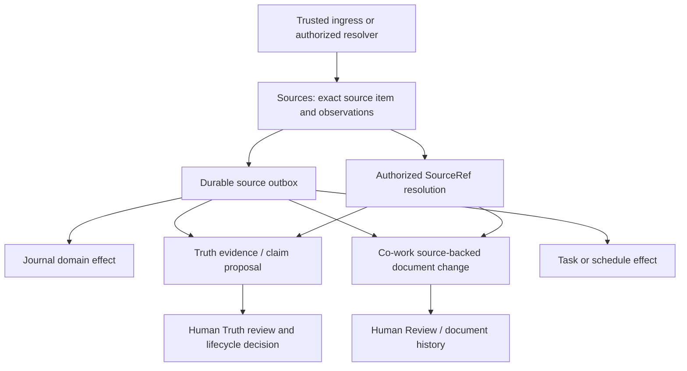

# Source foundation for Co-work and Work Buddy

**Status:** Proposed design and implementation plan, 2026-08-09. No product
implementation is authorized by this document.

**Primary input:** `C:\Users\Owner\OneDrive\Desktop\AI-human verbatim recording.md`,
reconciled against current `main` after PR #269.

- captured file size: 139,334 bytes;
- captured modified time: `2026-08-06T23:15:02.5336899Z`; and
- SHA-256: `b2a860d2b19e1942d50375dc74294f10cf44f22d52433217a58558c3af879527`.

These identify the exact export version used for this design; they do not by
themselves attest who authored any statement inside it.

## Decision

Introduce a narrow machine-level **Sources** bounded context beneath Truth,
Co-work, Journal, Tasks, scheduling, and conversation adapters.

`Sources` is a local subsystem name, not a claimed industry term of art. It
will record exact source occurrences, their provenance, later observations,
derivations, redaction state, authorized access, and reliable delivery to
domain consumers. It will not become a universal content database or absorb
the domains that consume source material.

The durable primitive is a **source item**. A trusted first-party submission is
a **human input event**, which is one source-item kind. It establishes the exact
submitted payload and local submitting principal/gesture; content authorship is
a separate assertion. A conversation message,
file import, voice recording, transcript, citation, document selection, or
external fetched passage can each be represented by a source item without
pretending that they have the same authorship or fidelity.

Every downstream domain keeps its own meaning and authority:

- Truth owns claims, evidence use, claim–evidence relationships, derivation, and claim
  lifecycle.
- Co-work owns collaborative documents, document versions, and document
  change history.
- Journal owns Journal entries, routing, lifecycle, and time semantics.
- Tasks owns task identity, status, scheduling metadata, and the master task
  representation.
- Sources owns where exact input came from and what was retained—not what it
  means or whether it is true.

## Why this must precede more Truth UX

The current AI-assisted Truth slice correctly freezes its input, stages AI
candidates, and requires a human decision before canonical mutation. However,
its canonical commit path currently collapses distinct acts: an AI-formulated
claim accepted by a human can be recorded as human-created, with the AI only in
metadata. That is a foundation error, not a wording problem.

Current source locators are also identifiers rather than resolvers. The
`wb-session` locator is provider-unqualified and syntax-validated only; it does
not establish what exact source was resolved, through which resolver, at what
revision, or with what identity assurance. Building richer frontend flows on
that substrate would make the provenance debt harder to unwind.

## Target relationship

The first transaction durably records the exact source item and an outbox
intent. Domain effects then materialize idempotently. We will not imply a
distributed atomic transaction across independent SQLite stores.

## Recommended architectural choices

1. **Exact source first.** Trusted input is durably captured before AI
   interpretation or downstream mutation.
2. **Authority-qualified references.** A structured `SourceRef` identifies the
   retained Sources authority and opaque item; its URI is only a serialization.
   Native provider coordinates live in a separate structured `origin_ref`.
3. **Occurrence identity, not text identity.** Two messages with identical text
   are two source items. Their content blobs may deduplicate by digest.
4. **Separate actor dimensions.** Source author/inputter, trusted issuer,
   selector, candidate preparer/matcher, semantic producer/reviser, evidence
   selector, execution authorizer, mutation applier, substantive reviewer,
   candidate decider, lifecycle decider, and attester do not collapse into
   `created_by`.
5. **Trusted ingress is not a human-authorship oracle.** A model may use an
   already captured source; the general agent API cannot assign human
   authorship. Direct-entry, paste, import, dictation, automation, and unknown
   modes retain their actual attribution basis.
6. **Portable domain provenance records.** Each consuming domain persists the provenance
   facts required by its own restore/export contract rather than depending on
   a live global lookup for meaning.
7. **Truth remains normalized.** Exact excerpts, evidence records, claims,
   claim–evidence relations, derivations, and lifecycle events remain separate.
8. **Co-work changes get graded assurance.** Opaque Yjs updates do not prove
   per-character authorship. Claims about a change state exactly what the
   server verified, what a trusted surface attested, and what was inferred.
9. **One source-owned outbox.** Durable effects are never delegated to the
   short-lived event log or generic agent retry queue as their source of truth.
10. **Redaction coordinates application-level readable-content deletion.** Managed readable copies,
    projections, and semantic derivatives are tracked with a crash-safe usage
    handshake and scrub/review policy; content-free identities and history can
    remain. Issued offline exports/backups follow their declared retention and
    cannot be falsely described as retroactively erased.

## Explicit non-goals

- Do not create a universal Work Buddy database or replace every domain store.
- Do not turn every captured input into a Truth claim.
- Do not call pasted, imported, or transcribed text human-authored without a
  trusted basis.
- Do not add a general MCP operation that accepts `actor_kind=human`.
- Do not treat a locator, model confidence, human click, or source hash as a
  universal “verified” flag.
- Do not replace the Tasks master list with Co-work.
- Do not promise headless Co-work insertion until the structured-document
  runtime decision is implemented.
- Do not redesign the primary frontend surfaces in this foundation program;
  only the minimum UI needed to exercise each vertical slice belongs here.
- Do not introduce the label “AI-human verbatim.”

## Delivery shape

The implementation is organized as four meaningful, user-testable stacked
pull requests rather than many narrow plumbing PRs:

1. Sources core, an authenticated loopback principal/gesture boundary, and a
   real Journal Quick Capture vertical slice.
2. Source-backed Truth composition, corrected multi-actor provenance, and the
   Work Buddy conversation → candidate decision → separate claim confirmation
   → Hindsight projection proof.
3. A headless structured-document kernel, domain-bound Co-work documents,
   source-backed changes, a continuous Co-work→Markdown projection seam, and
   one real Journal Running Note pilot.
4. Complete Journal and task-note migrations through separately gated rollout
   epochs.

Exact external harness resolvers and generalized cross-domain effects are
planned follow-ons after these four foundation slices rather than being hidden
inside the final migration PR. Work Buddy's own stable conversation provider and
the bounded Hindsight projection proof land with PR 2.

Each PR has internal checkpoints suitable for `/wb-dev-pr`, while the PR
description remains additive across checkpoints. See
[implementation-plan.md](implementation-plan.md).

## Document map

- [tldr.md](tldr.md) — the human-scannable decision and build order.
- [terminology-and-invariants.md](terminology-and-invariants.md) — candidate local
  vocabulary, standards alignment, trust rules, and actor distinctions.
- [current-state-audit.md](current-state-audit.md) — what exists on current
  `main`, what is reusable, and what is missing.
- [target-architecture.md](target-architecture.md) — records, boundaries,
  resolution, redaction, outbox, Truth, Co-work, Journal, and Tasks.
- [implementation-plan.md](implementation-plan.md) — phased work, exact
  vertical slices, acceptance criteria, and sequencing.
- [migration-validation-and-risks.md](migration-validation-and-risks.md) —
  compatibility, rollout, test matrix, failure recovery, privacy, and risks.

## Standards posture

The terminology is aligned where useful with the
[W3C PROV Ontology](https://www.w3.org/TR/prov-o/) separation of entities,
activities, agents, attribution, and derivation, and with the
[W3C Web Annotation Data Model](https://www.w3.org/TR/annotation-model/)
selector/state approach. These standards are conceptual and interchange
precedents; they do not prove Work Buddy's exact text fidelity, identity,
authorization, or semantic support. Those guarantees must come from our own
trusted ingress, resolver, hash, and policy checks.
