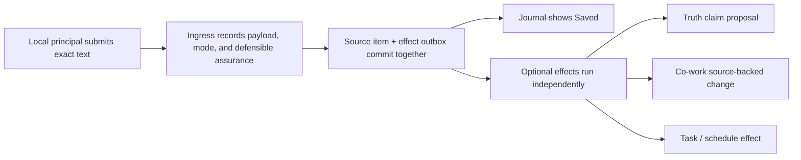

# TL;DR — the source foundation

**Implementation status:** The four accepted foundation slices are implemented
together. Safety-sensitive migrations,
optional model processing, and Truth-to-Hindsight egress remain disabled by
default. The sections below preserve the accepted reasoning and slice order;
[implementation-report.md](implementation-report.md) is the concise as-built
record and distinguishes checkpoint evidence from final release validation.

## The problem

We are about to make Truth much more AI-powered, but Work Buddy still lacks a
durable, shared answer to a simpler question:

> What exact thing did this come from, who actually did each part of the work,
> and what can the system honestly prove?

Today, several domains answer pieces of that question independently. Truth has
evidence snapshots; Co-work has document versions and provenance attestations;
conversations have message rows; Journal preserves draft text in the frontend;
imports have provenance prompts. They do not share one resolvable source
identity or one reliable handoff model.

The newest AI Truth path exposes the consequence: AI can formulate a claim and
a human can approve adding it, but the final canonical record can make it look
human-created. The UI cannot fix that distinction after the fact.

## The recommendation

Build a narrow machine-level subsystem called **Sources**.

Its unit is a **source item**: one exact captured occurrence with a stable,
authority-qualified `SourceRef`, retained representation/hash, explicit provenance,
authorized resolution, later observations, redaction state, and durable
downstream-effect intent.

Sources answers “where did this exact input come from?” It does **not** decide
what the input means or absorb the other domains.

| Domain | Continues to own |
|---|---|
| Truth | Claims, evidence use, support, derivation, and lifecycle |
| Co-work | Collaborative prose, versions, and document changes |
| Journal | Entries, routing, note lifecycle, and time semantics |
| Tasks | Task state, scheduling, and the master task list |
| Sources | Exact source identity, snapshot, provenance, access, observations, redaction, and reliable delivery |

## The crucial distinctions

We will record these as separate acts:

- who authored the source;
- who supplied/captured it;
- who selected an excerpt;
- who formulated a claim or interpretation;
- who applied a mutation;
- who authorized the execution/egress;
- who substantively reviewed the content;
- who made the candidate decision;
- who made any separate claim lifecycle decision; and
- what mechanism supports each assertion.

That means:

- AI-prepared + human-approved does not become human-authored.
- Pasted/imported by a human does not automatically mean authored by them.
- Even trusted local Quick Capture proves exact submission and its local
  principal/gesture under that surface's assurance; it does not cryptographically
  prove who composed the words.
- A voice transcript is machine-derived from audio, not automatically verbatim
  human text.
- A source URI is identity, not permission or proof.
- Exact quotation does not make a claim true.
- A Yjs update hash does not prove per-character authorship.

The implementation adds the previously missing authenticated dashboard-human
boundary: a persistent installation authority/local profile, a short-lived
loopback bootstrap into a revocable browser session, and one-time
context-bound decision gestures. Request headers do not establish identity.
Same-origin routing and `user_initiated()` consent are not proof of human
composition. Non-loopback/Tailscale human-authority writes stay disabled until
a verified remote principal provider exists; weak capture remains explicitly
labeled and cannot unlock PR 2's human-only decisions.

## What happens when someone enters text

“Saved” means the exact source and work intent are durable. AI or other effects
may still be pending, partially successful, or failed and retryable. One failed
effect never makes the original input look lost.

## What changes in Truth

The core operation becomes:

> Resolve one authorized source → kernel-copy the exact excerpt → atomically
> create/reuse evidence, span, proposed claim, claim–evidence relation, and derivation →
> let the human review it.

The model can point to an excerpt and formulate a proposition. It cannot mint a
human-authored quotation by repeating it. Truth will show **Prepared by AI**,
**Revised by** (when the human materially changes the candidate),
**Added/Connected by**, **Reviewed by** (only when substantive review actually
happened), and later **Confirmed/Challenged/Rejected by** as separate facts.
Connecting to an existing claim preserves that claim's original producer; AI
is only the matcher/preparer in that outcome. Evidence-only edits and changes
to whether the passage quotes/paraphrases a claim record the human selection or
relationship assessment without falsely changing claim authorship.

Adding or connecting a candidate is not the same decision as confirming that
claim as true. The records and UI keep those consequences separate.

The candidate also carries visible applicability scope and valid time. “Use
British spelling in this manuscript,” “I generally prefer British spelling,”
and “for this paragraph” must remain different claims; a later changed
preference supersedes or closes the earlier valid time instead of silently
rewriting it.

Existing Truth records remain historical. We will not rewrite old authorship
unless preserved runtime records prove a specific correction.

## What changes in Co-work

Co-work gains:

- explicit links from domain entities (a Running Note or task note) to a
  document;
- durable records for controlled document changes;
- exact source references and before/after document heads;
- separate author, selector, applier, and reviewer; and
- honest assurance labels such as document-kernel-verified,
  persistence-verified, projection-verified,
  trusted-surface-attested, user-attested, or inferred.

There is one major technical prerequisite: Python currently cannot construct
or edit Yjs/ProseMirror documents. The recommended solution is a small
headless, DOM-free TypeScript document kernel that shares the exact schema and
Markdown projection code with React. It is an explicitly trusted structural
component. Python independently owns authorization, source equality, request/
hash/CAS binding, idempotency, and persistence; it does not pretend to interpret
opaque Yjs structure.

## What does *not* change

- We do not make every capture a Truth claim.
- We do not move the task master list into Co-work.
- We do not turn schedules into documents.
- We do not make Sources a universal database.
- We do not let agents call a generic “create human input” capability.
- We do not migrate normalized transcript turns as exact source records.
- We do not keep Markdown and Co-work as permanent peer authorities.
- We do not start the large frontend/UX redesign yet.

## Implemented slice order

### Slice 1 — Exact capture that genuinely works

Build Sources v1 and connect Journal Quick Capture to a real backend/provider.
Preserve the actual `auto | log | running_notes` and `dumb | smart` contract.
The exact input and an outbox commit atomically; a minimal structured Journal
entry plus stable Markdown marker makes destination retry occurrence-safe.
Routing/smart processing can fail without losing the capture.

**Foundation proved:** defensible local submission provenance, exact retention,
idempotency, restart recovery, and honest saved-versus-processing UX.

### Slice 2 — Source-backed Truth

Add the atomic source-to-claim operation, typed claim–evidence relations,
portable source-resolution records, and correct AI-producer/human-decision
provenance. Agent Execution keeps ownership of AI runs and records an ordered
multi-source disclosure manifest before selected passages, existing Truth,
search results, or fetched pages reach the worker—and before model-produced
search/connector arguments leave Work Buddy. Ambiguous sends are conservatively
recorded and never automatically replayed. Reuse the existing Truth review
surface rather than redesigning it.

This slice also completes the original message path: exact Work Buddy conversation
message → AI preference proposal → human add/connect decision → separate claim
confirmation → eligible current-claim projection into Hindsight. Hindsight
retains the Truth reference and never becomes verbatim source authority.
Truth owns a transactional projection outbox and reconciliation sweep, so a
missed event or ambiguous Hindsight acknowledgement cannot strand stale memory.

**Foundation proved:** the original use case works and an AI interpretation no
longer masquerades as human authorship.

### Slice 3 — Source-backed Co-work changes

Build the shared headless document kernel, domain-owned bindings with a Co-work
mirror, document change records, recovery, and a real Running Note capture →
bound Co-work document pilot. Once that note switches authority, an idempotent
projection worker follows every durable Co-work head—including ordinary editor
changes—into its managed Markdown section and pauses on external divergence.

**Foundation proved:** headless domain prose changes are safe, recoverable, and
honestly attributable.

### Slice 4 — Migrate Journal and task-note prose

Move Journal prose and task-note bodies through compatibility adapters into
bound Co-work documents; retain safe, externally editable Markdown projections
and the task master list. Journal and task notes use separate internal authority
epochs, divergence detection, import/review, and rollback gates.

**Foundation proved:** existing domains can adopt Sources/Co-work without
breaking Obsidian workflows or inventing provenance.

Exact external harness providers, generalized task/schedule effects, broader
source rechecking, and the larger frontend pass follow afterward; they are not
hidden inside PR 4's migration boundary. The harness extension contract still
requires a trusted current-turn bridge to capture the exact prompt before
normalization/TTL loss and inject an opaque prompt-scoped `SourceRef`; it never
uses “latest message” or turn index as identity.

These remain four genuinely separate architectural and test boundaries, but
the accepted delivery is one larger PR. Use larger phase checkpoints and amend
the cumulative PR description rather than replacing it.

## Accepted implementation decisions

1. Use **Sources** as the local subsystem name and **source item** as its unit.
2. Capture exact source content before AI interpretation.
3. Use a machine-level Sources store with portable domain-owned provenance and
   evidence snapshots.
4. Keep all actor roles independent; human approval is not authorship.
5. Use a source-owned transactional outbox rather than Events/retry as capture
   authority.
6. Add a shared headless TypeScript document kernel instead of reimplementing
   ProseMirror/Yjs semantics in Python, and label its trust honestly.
7. Deliver the four substantial slices above in one cumulative PR, in order.
8. Defer the major Truth/Co-work frontend redesign until these foundations
   pass their end-to-end gates.
9. Require a crash-safe usage/redaction handshake, external-model egress policy,
   and encrypted/retention-fenced backup decision before sensitive Sources data
   is enabled.

## The one-sentence end state

Work Buddy will be able to preserve an exact submitted or external source once,
derive AI-assisted work from it across domains, and show—without collapsing
roles—what came from the source, what AI inferred, what the system changed, and
what a human actually approved.
