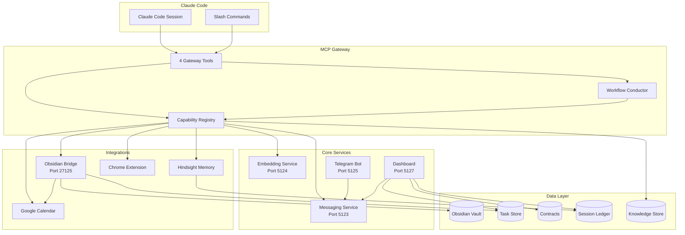

<p align="center">
    
</p>

<h1 align="center">work-buddy</h1>

<p align="center">
    Your AI doesn't understand how you actually operate. Meet <b>work-buddy</b>.
</p>

<p align="center">
    <a href="https://docs.work-buddy.ai"></a>
    
    <a href="https://github.com/KadenMc/work-buddy/actions"></a>
    <a href="https://codecov.io/gh/KadenMc/work-buddy"></a>
    
    <a href="https://github.com/sponsors/KadenMc"></a>
</p>

<h3 align="center"><a href="https://work-buddy.ai/">Website</a></h3>

<p align="center">
    <a href="https://docs.work-buddy.ai">Docs</a> &bull;
    <a href="#quick-start">Quick Start</a> &bull;
    <a href="#how-it-works">How It Works</a> &bull;
    <a href="#why-this-is-different">Why It's Different</a> &bull;
    <a href="#features">Features</a> &bull;
    <a href="#architecture">Architecture</a> &bull;
    <a href="CONTRIBUTING.md">Contributing</a>
</p>

---

**work-buddy** is the AI assistant for knowledge workers — a local-first personal-agent runtime built on [Claude Code](https://docs.anthropic.com/en/docs/claude-code) and [Obsidian](https://obsidian.md/) that organizes the work *around* the work: backlogged notes, scattered tasks, open browser tabs, and the projects they belong to. It gives your agent structured multi-step workflows, memory that survives across sessions, deep integration with the tools your work already lives in, and a dashboard that lends visibility and collaboration.

**Runs on your existing Claude Code subscription** — no separate service fees. The agent you're already paying for does the work; your data stays on your machine.

<p align="center">
    
    <br>
    <em>The dashboard's Chats tab — browsing and searching across agent sessions.</em>
</p>

<!-- Replace with demo video when ready -->

### What this looks like in practice

- Review today's work state across notes, tasks, git, browser, and calendar before planning
- Triage 40 open Chrome tabs into close, task, group, or keep decisions
- Empty your scratchpad — quick captures get routed into tasks, references, or kept as open questions
- Run a morning routine that writes a briefing, picks your top priorities, and generates a day plan
- Have the agent surface what would help next — captured fragments, stale tasks, drifted projects — proactively, before you have to ask
- Keep agent sessions coordinated through dashboard threads, notifications, and approvals

### Principles that shape the framework

- **Preserve user agency** — automate what's deterministic; review, approval, and steering for what's ambiguous
- **Reduce coordination burden** — structure the work *around* your work so you don't have to
- **Maximize cost efficiency** — only invoke the LLM when reasoning is actually required; run deterministic steps as code
- **Build your own customized workflows** — the same gateway and conductor you use to work are used to extend the framework

---

## The Problem

Modern knowledge work is fragmented across notes, tasks, projects, browser tabs, contracts, calendars, and ephemeral agent sessions. The problem is not just that AI forgets yesterday — that's getting solved. It's that neither the AI nor the user has a good runtime for coordinating all this state.

Without that layer, you either do the coordination work manually or let the assistant act with too little grounding and too little oversight. You end up repeating context, re-explaining priorities, and manually stitching together work that should flow smoothly every time.

work-buddy exists to close that gap by giving your agent **structure** (workflows and capabilities), **continuity** (persistent context across sessions), and **reach** (integrations with the tools where your work actually lives).

**The design principle:** automate what is deterministic, surface what is ambiguous, and preserve your agency.

## How It Works

work-buddy runs a local [MCP server](https://modelcontextprotocol.io/) that extends Claude Code with a **gateway pattern** — a handful of tools that empowers your agent with many capabilities, allowing them to run complex, cohesive end-to-end workflows:

```
wb_search  → discover what's available (natural language)
wb_run     → execute a capability or start a workflow
wb_advance → step through a multi-step workflow
wb_status  → check progress or system health
```

**Capabilities** are single functions. **Workflows** are multi-step DAGs with dependency ordering and persistent state. Both live in the knowledge store — a typed, searchable registry that agents query at runtime.

### Agentic-programmatic interleaving

Most agent frameworks route everything through the LLM — every step, every decision, every data transformation. This is expensive, slow, and fragile. work-buddy takes a different approach: **use the model as little as possible.**

Workflows interleave **programmatic steps** (deterministic code — config loading, data formatting, API calls) with **agentic steps** (LLM reasoning — synthesis, judgment, user interaction). The conductor runs code steps automatically and only hands control to the agent when reasoning is actually needed.

The heuristic is simple: if you can write a unit test with a fixed expected output, it's a code step. If the "correct" output depends on interpretation, it's an agent step. The result is workflows that are faster, cheaper, more reproducible — and more powerful, because the agent's context isn't wasted on mechanical work.

<details>
<summary><strong>Example: what a morning routine looks like</strong></summary>

```
> /wb-morning

Step 1/9: [auto] Load config and resolve target date        ← code
Step 2/9: [auto] Read sign-in state from journal            ← code
Step 3/9: [agent] Collect and synthesize context             ← reasoning
Step 4/9: [auto] Fetch contract health data                  ← code
Step 5/9: [auto] Pull calendar events                        ← code
Step 6/9: [agent] Task briefing — prioritize, flag issues    ← reasoning
Step 7/9: [agent] Metacognition check — detect drift         ← reasoning
Step 8/9: [agent] Generate day plan                          ← reasoning
Step 9/9: [auto] Write briefing to journal                   ← code
```

Five of nine steps run as deterministic code — no tokens spent, no latency, no variability. The agent only engages for the four steps that genuinely need judgment. The conductor manages the DAG, blocks on unmet dependencies, and persists state so you can resume if interrupted.

</details>

---

## Why This Is Different

Most agent frameworks help developers build agents. work-buddy is narrower and more opinionated: it helps a person run **AI-assisted knowledge work locally**, against the tools and context where their work already lives.

- **Unlike generic orchestration frameworks**, work-buddy ships with concrete workflows for planning, task triage, backlog handling, context collection, browser triage, and project coordination.
- **Unlike autonomy-first agent systems**, work-buddy is built around review, approval, correction, and user steering.
- **Unlike cloud-first control planes**, work-buddy keeps the runtime local with strong user-facing oversight surfaces.

The dashboard is not just observability. It is part of the control loop: a place for live status, persistent threads, decision prompts, notifications, and reviewable workflow views, so you can steer the system without doing all the coordination work yourself.

---

## Features

### Core Framework

| | |
|---|---|
| **MCP Gateway** | Four tools, dynamic discovery. `wb_search("tasks")` finds every task capability with full parameter schemas. No guessing — search first, then execute. |
| **Workflow Conductor** | Multi-step DAGs with dependency ordering, [auto-run steps](#agentic-programmatic-interleaving) for deterministic code, execution policy (main session vs. subagent), and persistent state. Workflows chain into sub-workflows. |
| **Knowledge Store** | Typed JSON registry with hierarchical navigation. Agents query `agent_docs` at runtime — capabilities, workflows, and documentation are all discoverable in one call. |
| **Human-in-the-Loop** | Consent-gated operations, multi-surface notifications, persistent threads, and live observability. [More below.](#you-stay-in-control) |

### Flagship workflows

| Workflow | What it does |
|---|---|
| **Morning Routine** | Collects fresh context, checks sign-in, reviews contracts/tasks/calendar, synthesizes a briefing, picks your top priorities, and generates a day plan. |
| **Chrome Triage** | Clusters and summarizes open tabs, asks clarifying questions when needed, collects user decisions, and executes approved actions. |
| **Process Backlog** | Walks through captured notes one thread at a time, routing each item into a task, a reference, or an open question — and leaves the unresolved rest behind as a cleaner backlog. |
| **Task Triage / Weekly Review** | Reviews inbox, staleness, commitments, and active work with structured follow-through. |

### Integrations

| | |
|---|---|
| **Obsidian** | Deep vault access via a custom bridge plugin — native integration with Tasks, Day Planner, Tag Wrangler, Smart Connections, Datacore, and Google Calendar. Not file I/O; plugin-level access. |
| **Persistent Memory** | Built on [Hindsight](https://github.com/anthropics/hindsight). Your agent retains preferences, project context, and working patterns across sessions. Semantic search over your memory bank. |
| **Telegram** | Mobile command center: approve consent, resume sessions, trigger workflows, capture notes — all from your phone. |
| **Chrome** | Companion extension exports open tabs. Semantic clustering, content extraction, activity inference, and a four-tier triage workflow. |
| **Web Dashboard** | Live observability, thread conversations, session browsing, task board, notification management. Remote access via Tailscale. |

### Productivity

| | |
|---|---|
| **Task Management** | Full lifecycle: create, triage, assign, track, review. Weekly reviews, inbox triage, stale-task detection — all built-in workflows. |
| **Contract System** | Explicit work commitments with claims, evidence plans, stop rules, and Theory of Constraints bottleneck tracking. |
| **Context Collection** | Gather signals from git, Obsidian, conversations, Chrome, calendar into structured bundles. Agents orient on what you've been doing before deciding what to do next. |
| **Metacognition** | Framework for any kind of self-accountability: name the patterns you want help catching (work habits, focus, health signals, whatever you want to be held to), document them in personal knowledge, and the agent scans for them and responds with the matching intervention level. |

### Infrastructure

| | |
|---|---|
| **Inter-Agent Messaging** | Asynchronous message passing between sessions. Hand off tasks, share findings, coordinate — without human relay. |
| **Project System** | Project registry with identity, observations, and memory. Track decisions, pivots, blockers across time. Auto-discovery from task tags and git repos. |
| **Sidecar Supervisor** | Manages long-running services (messaging, embedding, Telegram, dashboard) — starts on demand, restarts on failure, health-checks on schedule. |
| **Feature Toggles** | Dependency-aware system lets you enable/disable subsystems based on what you have installed. Core stays lean. |

---

## You Stay in Control

Powerful agents are only useful if you can trust them. work-buddy is built around **convenient consent — automation without handing over control.** Not as a safety afterthought, but as a core design choice.

**Consent-gated operations.** Sensitive actions — deleting tasks, pruning memory, modifying vault content — require your explicit approval before they execute. Consent requests are delivered simultaneously to every surface you have connected. Grants are session-scoped and time-limited.

**Respond from anywhere.** Consent requests, notifications, and decision prompts arrive on your phone (Telegram), in your knowledge base (Obsidian modals), and on the web dashboard — all at once. Respond on whichever surface is convenient; the others auto-dismiss. First response wins.

**Mobile command center.** From Telegram, you can approve consent requests, respond to agent questions, resume previous sessions, trigger slash commands, and capture notes — without being at your computer. Turn any agent session into a remotely supervised one.

**Live observability.** The web dashboard gives you a real-time view of what your agents are doing: active sessions, task state, contract health, notification queue, and full conversation history. Accessible remotely via Tailscale.

**Thread conversations.** Agents can open persistent chat threads on the dashboard for multi-turn discussions that outlive any single session — asking questions, reporting progress, and collecting decisions over time.

Your agents work autonomously when they can, and check in when they should. You set the boundaries.

---

## Self-Developing

work-buddy builds work-buddy. The same gateway, conductor, knowledge store, and slash commands that manage your daily work are also used to extend the framework itself — tell an agent what you want, and the foundation does the heavy lifting so your idea ships instead of stalling.

**What gets built is yours to read, edit, share, or remove.** The agent drafts; you curate. **What your agent does for you is yours.**

**Want to add a workflow?** Tell your agent what you want, and it will:

1. Create a `WorkflowUnit` in the knowledge store with your step DAG and instructions
2. Register any new capabilities needed by the workflow
3. Create a slash command as a thin launcher
4. Run `/wb-dev-test` to validate everything passes
5. Run `/wb-dev-push` to confirm it's ready to ship

You direct the agent. The agent writes the code. work-buddy provides the structure so neither of you gets lost.

<details>
<summary><strong>The dev toolkit</strong></summary>

| Command | What it does |
|---------|-------------|
| `/wb-dev` | Orient on architecture, patterns, and where to look |
| `/wb-dev-test` | Run the right tests for what changed, check coverage, report readiness |
| `/wb-dev-push` | Pre-push checklist: tests, knowledge store validation, DAG integrity |
| `/wb-dev-retro` | Critique this session's execution, diagnose issues, hand off fixes |
| `/wb-task-handoff` | Package context so the next session can continue seamlessly |

</details>

---

## Architecture



A **sidecar supervisor** manages long-running services — starts them on demand, restarts on failure, health-checks on schedule.

---

## Quick Start

### Fastest path to first value

1. Download and run the installer, then open the install folder in Claude Code
2. Run `/wb-setup guided`
3. Open the dashboard
4. Try `/wb-morning` or `/wb-task-triage`

### Prerequisites

- [Claude Code](https://docs.anthropic.com/en/docs/claude-code) (CLI or Desktop)
- [Obsidian](https://obsidian.md/) (recommended, not strictly required for core functionality)

work-buddy bundles its own Python, so there is nothing else to install first. No system Python, conda, or package manager is required.

### Install

Download the installer for your platform from the [latest release](https://github.com/KadenMc/work-buddy/releases/latest), then run it.

| Platform | Installer | How to run it |
|----------|-----------|---------------|
| Windows | `work-buddy-<version>-setup.exe` | Double-click and follow the prompts |
| macOS | *(planned)* | |
| Linux | *(planned)* | |

The installer sets up a private Python environment (using [uv](https://docs.astral.sh/uv/), which it bundles), downloads work-buddy's dependencies (about 1 GB, one time), creates a per-user data folder, and registers work-buddy to start at login. Everything installs under your own user account, and no system Python is touched.

When it finishes, open the install folder in Claude Code and run `/wb-setup guided`. That walkthrough lets you choose which features to enable and completes the integrations (vault path, timezone, optional services), flagging anything missing with fix instructions.

### Connect to Claude Code

The installer writes a project-level `.mcp.json` into the install folder, so opening that folder in Claude Code discovers the work-buddy gateway automatically. There is nothing to wire up by hand.

To connect a different Claude Code setup, point it at the gateway directly (or run `wbuddy mcp print` to emit this):

```json
{
  "mcpServers": {
    "work-buddy": {
      "type": "http",
      "url": "http://localhost:5126/mcp"
    }
  }
}
```

Your settings live in `config.yaml` in the install folder (vault path, timezone, enabled features); `/wb-setup guided` fills them in interactively, and machine-specific overrides go in `config.local.yaml` (gitignored). Then, inside Claude Code:

```
> /wb-morning    # Run the morning routine
> /wb-dev        # Enter development mode
```

### GPU Acceleration

The installer sets up CPU-only PyTorch. If you have an NVIDIA GPU, installing the CUDA build significantly speeds up embeddings, semantic search, and anything that touches `sentence-transformers`.

<details>
<summary><strong>[Windows/Linux] NVIDIA CUDA</strong></summary>

Replace the CPU wheel in the install environment (swap your install folder in for `<install-folder>`):

```bash
"<install-folder>\.venv\Scripts\python" -m pip install torch --index-url https://download.pytorch.org/whl/cu126 --force-reinstall
```

On macOS/Linux the interpreter is `<install-folder>/.venv/bin/python` instead. Verify GPU access:

```bash
"<install-folder>\.venv\Scripts\python" -c "import torch; print(torch.cuda.is_available(), torch.cuda.get_device_name(0))"
# Expected: True NVIDIA GeForce RTX ...
```
</details>

<details>
<summary><strong>[macOS] Apple Silicon (MPS)</strong></summary>

The default PyTorch wheel includes MPS support on Apple Silicon, so no extra step is needed.

```bash
"<install-folder>/.venv/bin/python" -c "import torch; print(torch.backends.mps.is_available())"
```
</details>

> **Note:** work-buddy pins `python = ">=3.11,<3.12"` because `triton` (a torch dependency) does not declare support for Python 3.14+, and the resolver rejects ranges that could include unsupported versions.

### Optional: Persistent Memory (Hindsight)

work-buddy runs fully without persistent memory. Memory is an advanced, optional add-on: it needs the `memory` Python extra, a PostgreSQL server with the pgvector extension, and the Hindsight API server running alongside work-buddy.

This is a manual, from-source setup rather than a one-click feature. Install the extra with `uv pip install -e ".[memory]"` (see [CONTRIBUTING.md](CONTRIBUTING.md) for the from-source environment), provide a PostgreSQL instance with pgvector (through your platform's package manager, [Postgres.app](https://postgresapp.com/), or Docker), and run the Hindsight API per its documentation. Inside work-buddy, `agent_docs path=memory/hindsight` describes how memory is wired, including the bank bootstrap and the `hindsight.bank_id` setting.

### Running Services

The installer registers work-buddy to start at login, so normally nothing needs to be run by hand. To control it manually:

```bash
wbuddy start     # start the sidecar (MCP gateway, messaging, embedding, dashboard)
wbuddy stop      # stop it
wbuddy status    # health check
```

The sidecar supervises messaging (`:5123`), embedding (`:5124`), the dashboard (`:5127`), and optionally Telegram (`:5125`); the MCP gateway itself runs at `:5126`. From within Claude Code, `/wb-setup` runs the setup wizard with diagnostics and requirement validation, and `/wb-setup-help` gives targeted component checks.

<details>
<summary><strong>Auto-start on login</strong></summary>

The installer sets this up for you: a per-user login task that starts the work-buddy sidecar, with no administrator rights required. To manage it by hand:

```bash
wbuddy autostart enable    # register the login task
wbuddy autostart disable   # remove it
wbuddy autostart status    # check whether it is registered
```

This uses the platform's per-user login mechanism (Task Scheduler on Windows, a systemd user service on Linux, a launchd agent on macOS).
</details>

### Remote Access

The dashboard can be published privately via [Tailscale](https://tailscale.com/):

```bash
tailscale serve --bg 5127
```

Set `dashboard.external_url` in `config.yaml` to enable "View in dashboard" links in Telegram notifications.

### What Lives Where

| Layer | Managed by | What it provides |
|-------|-----------|-----------------|
| Install folder | the installer | Code, assets, `config.yaml`, secrets (`.env`) |
| `.venv` | uv (bundled) | All Python packages (torch, mcp, flask, etc.) |
| Data folder | the installer | Databases, caches, logs, consent (hidden per-user dir) |
| `config.yaml` | you / `/wb-setup` | Vault path, timezone, service ports, enabled features |
| `config.local.yaml` | you (gitignored) | Machine-specific overrides (bank IDs, paths) |

---

## Slash Commands

All 36 commands are prefixed `wb-` for easy discovery. Highlights:

| Command | What it does |
|---------|-------------|
| `/wb-morning` | Full morning routine: close yesterday, gather context, plan today |
| `/wb-context-collect` | Gather signals from git, Obsidian, chats, Chrome |
| `/wb-task-triage` | Interactive inbox review: batch-decide on tasks |
| `/wb-journal-update` | Detect recent activity, append to today's journal |
| `/wb-meta-blindspots` | Check work against documented failure patterns |
| `/wb-dev` | Enter development mode with architecture orientation |
| `/wb-setup` | Setup wizard: validate config, choose features, diagnose issues |
| `/wb-task-handoff` | Create a task with full handoff context for a new session |

---

## Project Structure

```
work_buddy/              # Python package (277 modules, ~58k LOC)
  mcp_server/            # MCP gateway (4 tools, dynamic discovery)
  workflow.py            # DAG conductor with execution policy
  dashboard/             # Web dashboard (Flask, port 5127)
  messaging/             # Inter-agent messaging service
  notifications/         # Multi-surface notification system
  memory/                # Hindsight memory integration
  telegram/              # Telegram bot sidecar
  obsidian/              # Obsidian bridge + plugin integrations
  knowledge/             # Typed JSON documentation store
  health/                # Feature toggles, diagnostics, setup wizard, requirements
  sessions/              # Conversation inspection + search

knowledge/               # Agent documentation + workflow DAGs (canonical store)
contracts/               # Work commitment tracking
.claude/commands/        # 36 slash commands (wb-* prefix)
tests/                   # pytest + freezegun test suite
```

Each subsystem has its own README.

---

## Configuration

Layered config system:

- `config.yaml` — project-wide settings (checked in)
- `config.local.yaml` — machine-specific overrides + feature preferences (gitignored)
- `CLAUDE.local.md` — personal behavioral instructions for your agent (gitignored)

Feature preferences live in `config.local.yaml` under a `features:` key. Set `wanted: false` on any component to opt out — agents won't suggest it, the dashboard hides it, and probes are skipped. Run `/wb-setup preferences` to manage these interactively.

Features are modular. The dependency-aware toggle system lets you enable/disable subsystems based on what you have installed.

---

## Status

work-buddy is pre-release software, actively developed by one person and the agents they direct. It runs reliably day-to-day, but known limitations remain:

- **Developed on Windows 11.** Linux and macOS support is new — cross-platform compatibility has been audited and the core paths are guarded, but edge cases may remain. Issues and PRs for other platforms are especially welcome.
- Setup requires some manual configuration
- Documentation assumes familiarity with Claude Code and Obsidian
- Some features are tightly coupled to specific local setups
- The API surface is not yet stable

That said — this is a framework designed to be extended. If you use Claude Code and want structured workflows, persistent memory, and deep tool integration, this is built for you.

## Contributing

We welcome contributions — bug fixes, new capabilities, workflows, integrations, and documentation. See **[CONTRIBUTING.md](CONTRIBUTING.md)** for the full guide.

The fastest way to get started: clone the repo, install, and run `/wb-dev`. Your agent will orient itself.

For bugs and feature requests, [open an issue](https://github.com/KadenMc/work-buddy/issues).

## License

work-buddy is free software, licensed under the **[GNU General Public License v3.0](LICENSE)** (`GPL-3.0-only`).

Use it, study it, modify it, share it. The GPL adds one reciprocal condition: anyone you pass a modified version to receives the same freedoms you had. work-buddy is built for individuals, and copyleft is how it stays that way — improvements to the runtime keep flowing back to the people who use it rather than being absorbed into a closed product.

Copyright © 2025–2026 Kaden McKeen.
