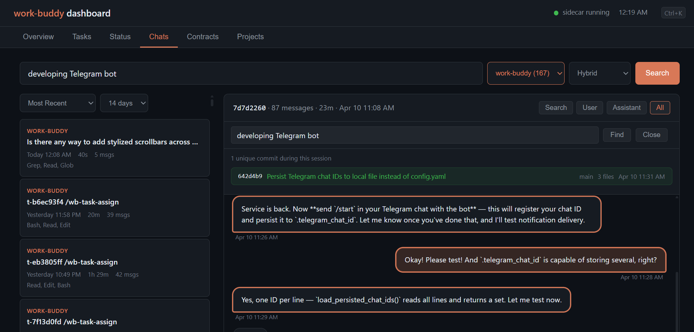
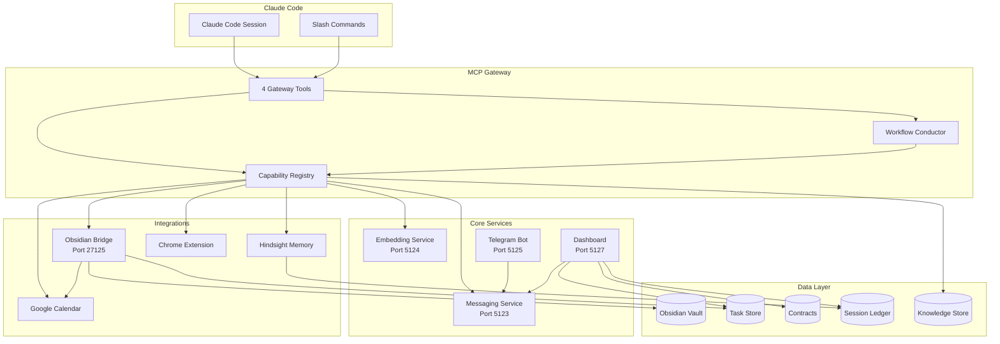

<p align="center">
    
</p>

<h1 align="center">work-buddy</h1>

<p align="center">
    Your AI doesn't know you; it can't remember yesterday. Meet <b>work buddy</b>.
</p>

<p align="center">
    <a href="https://docs.work-buddy.ai"></a>
    
    <a href="https://github.com/KadenMc/work-buddy/actions"></a>
    <a href="https://codecov.io/gh/KadenMc/work-buddy"></a>
    
    <a href="https://github.com/sponsors/KadenMc"></a>
</p>

<p align="center">
    <a href="https://docs.work-buddy.ai">Docs</a> &bull;
    <a href="#quick-start">Quick Start</a> &bull;
    <a href="#how-it-works">How It Works</a> &bull;
    <a href="#features">Features</a> &bull;
    <a href="#architecture">Architecture</a> &bull;
    <a href="CONTRIBUTING.md">Contributing</a>
</p>

---

**work-buddy** is a personal agent framework built on [Claude Code](https://docs.anthropic.com/en/docs/claude-code) and [Obsidian](https://obsidian.md/) which orchestrates tasks, manages workflows, coordinates across projects — so you can focus on your actual work. It gives your AI agent structured multi-step workflows, memory that survives across sessions, deep integration with external tooling, and a dashboard that empowers you directly!

It runs locally, uses your own API keys, and stores everything on your machine. No cloud dependencies. Your workflows, your data, your agent.

> **90+ capabilities** &bull; **15+ structured workflows** &bull; **34 slash commands** &bull; **205 Python modules** &bull; **Most commits authored by agents**

<p align="center">
    
    <br>
    <em>The dashboard's Chats tab — browsing and searching across agent sessions.</em>
</p>

<!-- Replace with demo video when ready -->

---

## The Problem

Claude Code is powerful, but every session starts from zero. Your agent doesn't know what you were working on yesterday. It can't check your calendar, manage your tasks, or coordinate with the agent session you ran an hour ago. You end up repeating context, re-explaining priorities, and manually stitching together work that should flow smoothly everytime.

work-buddy fixes this by giving your agent **structure** (workflows and capabilities), **memory** (persistent context across sessions), and **reach** (integrations with the tools where your work actually lives).

**The design principle:** empower your agents without losing your agency.

## How It Works

work-buddy runs a local [MCP server](https://modelcontextprotocol.io/) that extends Claude Code with a **gateway pattern** — a handful of tools that empowers your agent with many capabilities, allowing them to run complex, cohesive end-to-end workflows:

```
wb_search  → discover what's available (natural language)
wb_run     → execute a capability or start a workflow
wb_advance → step through a multi-step workflow
wb_status  → check progress or system health
```

**Capabilities** are single functions. **Workflows** are multi-step DAGs with dependency ordering and persistent state. Both live in the knowledge store — a typed, searchable registry that agents query at runtime.

### Agentic-programmatic interleaving

Most agent frameworks route everything through the LLM — every step, every decision, every data transformation. This is expensive, slow, and fragile. work-buddy takes a different approach: **use the model as little as possible.**

Workflows interleave **programmatic steps** (deterministic code — config loading, data formatting, API calls) with **agentic steps** (LLM reasoning — synthesis, judgment, user interaction). The conductor runs code steps automatically and only hands control to the agent when reasoning is actually needed.

The heuristic is simple: if you can write a unit test with a fixed expected output, it's a code step. If the "correct" output depends on interpretation, it's an agent step. The result is workflows that are faster, cheaper, more reproducible — and more powerful, because the agent's context isn't wasted on mechanical work.

<details>
<summary><strong>Example: what a morning routine looks like</strong></summary>

```
> /wb-morning

Step 1/9: [auto] Load config and resolve target date        ← code
Step 2/9: [auto] Read sign-in state from journal            ← code
Step 3/9: [agent] Collect and synthesize context             ← reasoning
Step 4/9: [auto] Fetch contract health data                  ← code
Step 5/9: [auto] Pull calendar events                        ← code
Step 6/9: [agent] Task briefing — prioritize, flag issues    ← reasoning
Step 7/9: [agent] Metacognition check — detect drift         ← reasoning
Step 8/9: [agent] Generate day plan                          ← reasoning
Step 9/9: [auto] Write briefing to journal                   ← code
```

Five of nine steps run as deterministic code — no tokens spent, no latency, no variability. The agent only engages for the four steps that genuinely need judgment. The conductor manages the DAG, blocks on unmet dependencies, and persists state so you can resume if interrupted.

</details>

---

## Features

### Core Framework

| | |
|---|---|
| **MCP Gateway** | Four tools, dynamic discovery. `wb_search("tasks")` finds every task capability with full parameter schemas. No guessing — search first, then execute. |
| **Workflow Conductor** | Multi-step DAGs with dependency ordering, [auto-run steps](#agentic-programmatic-interleaving) for deterministic code, execution policy (main session vs. subagent), and persistent state. Workflows chain into sub-workflows. |
| **Knowledge Store** | Typed JSON registry with hierarchical navigation. Agents query `agent_docs` at runtime — capabilities, workflows, and documentation are all discoverable in one call. |
| **Human-in-the-Loop** | Consent-gated operations, multi-surface notifications, mobile access, and live observability. [More below.](#you-stay-in-control) |

### Integrations

| | |
|---|---|
| **Obsidian** | Deep vault access via a custom bridge plugin — native integration with Tasks, Day Planner, Tag Wrangler, Smart Connections, Datacore, and Google Calendar. Not file I/O; plugin-level access. |
| **Persistent Memory** | Built on [Hindsight](https://github.com/anthropics/hindsight). Your agent retains preferences, project context, and working patterns across sessions. Semantic search over your memory bank. |
| **Telegram** | Mobile command center: approve consent, resume sessions, trigger workflows, capture notes — all from your phone. |
| **Chrome** | Companion extension exports open tabs. Semantic clustering, content extraction, activity inference, and a four-tier triage workflow. |
| **Web Dashboard** | Live observability, thread conversations, session browsing, task board, notification management. Remote access via Tailscale. |

### Productivity

| | |
|---|---|
| **Task Management** | Full lifecycle: create, triage, assign, track, review. Weekly reviews, inbox triage, stale-task detection — all built-in workflows. |
| **Contract System** | Explicit work commitments with claims, evidence plans, stop rules, and Theory of Constraints bottleneck tracking. |
| **Context Collection** | Gather signals from git, Obsidian, conversations, Chrome, calendar into structured bundles. Agents orient on what you've been doing before deciding what to do next. |
| **Metacognition** | Documented patterns for failure modes: scope drift, branch explosion, infrastructure displacement. The agent names patterns and applies minimal interventions. |

### Infrastructure

| | |
|---|---|
| **Inter-Agent Messaging** | Asynchronous message passing between sessions. Hand off tasks, share findings, coordinate — without human relay. |
| **Project System** | Project registry with identity, observations, and memory. Track decisions, pivots, blockers across time. Auto-discovery from task tags and git repos. |
| **Sidecar Supervisor** | Manages long-running services (messaging, embedding, Telegram, dashboard) — starts on demand, restarts on failure, health-checks on schedule. |
| **Feature Toggles** | Dependency-aware system lets you enable/disable subsystems based on what you have installed. Core stays lean. |

---

## You Stay in Control

Powerful agents are only useful if you can trust them. work-buddy is built around **human-in-the-loop by default** — not as a safety afterthought, but as a core design choice.

**Consent-gated operations.** Sensitive actions — deleting tasks, pruning memory, modifying vault content — require your explicit approval before they execute. Consent requests are delivered simultaneously to every surface you have connected. Grants are session-scoped and time-limited.

**Respond from anywhere.** Consent requests, notifications, and decision prompts arrive on your phone (Telegram), in your knowledge base (Obsidian modals), and on the web dashboard — all at once. Respond on whichever surface is convenient; the others auto-dismiss. First response wins.

**Mobile command center.** From Telegram, you can approve consent requests, respond to agent questions, resume previous sessions, trigger slash commands, and capture notes — without being at your computer. Turn any agent session into a remotely supervised one.

**Live observability.** The web dashboard gives you a real-time view of what your agents are doing: active sessions, task state, contract health, notification queue, and full conversation history. Accessible remotely via Tailscale.

**Thread conversations.** Agents can open persistent chat threads on the dashboard for multi-turn discussions that outlive any single session — asking questions, reporting progress, and collecting decisions over time.

Your agents work autonomously when they can, and check in when they should. You set the boundaries.

---

## Self-Developing

This is the part that's hard to explain until you see it.

work-buddy develops itself. The same gateway, conductor, and slash commands that manage your daily work are also used to build the framework. Most of the commits in this repo were authored by Claude Code agents using work-buddy's own tooling.

**Want to add a workflow?** Tell your agent what you want, and it will:

1. Create a `WorkflowUnit` in the knowledge store with your step DAG and instructions
2. Register any new capabilities needed by the workflow
3. Create a slash command as a thin launcher
4. Run `/wb-dev-test` to validate everything passes
5. Run `/wb-dev-push` to confirm it's ready to ship

You direct the agent. The agent writes the code. work-buddy provides the structure so neither of you gets lost.

<details>
<summary><strong>The dev toolkit</strong></summary>

| Command | What it does |
|---------|-------------|
| `/wb-dev` | Orient on architecture, patterns, and where to look |
| `/wb-dev-test` | Run the right tests for what changed, check coverage, report readiness |
| `/wb-dev-push` | Pre-push checklist: tests, knowledge store validation, DAG integrity |
| `/wb-dev-retro` | Critique this session's execution, diagnose issues, hand off fixes |
| `/wb-task-handoff` | Package context so the next session can continue seamlessly |

</details>

---

## Architecture



A **sidecar supervisor** manages long-running services — starts them on demand, restarts on failure, health-checks on schedule.

---

## Quick Start

### Prerequisites

- [Claude Code](https://docs.anthropic.com/en/docs/claude-code) (CLI or Desktop)
- Python 3.11 (via [Miniforge](https://github.com/conda-forge/miniforge) or similar)
- [Obsidian](https://obsidian.md/) (recommended, not strictly required for core functionality)

### Install

```bash
git clone https://github.com/KadenMc/work-buddy.git
cd work-buddy

conda create -n work-buddy python=3.11 -y
conda activate work-buddy

pip install poetry
poetry install

# Optional features
poetry install --extras memory    # Persistent memory (Hindsight)
poetry install --extras telegram  # Telegram bot
poetry install --extras all       # Everything
```

### Configure

```bash
cp config.example.yaml config.yaml
# Edit: vault path, timezone, enabled services
```

Machine-specific overrides (e.g., `hindsight.bank_id`) go in `config.local.yaml` (gitignored). Copy `config.local.example.yaml` as a starting point.

### Connect to Claude Code

```json
{
  "mcpServers": {
    "work-buddy": {
      "command": "work-buddy-mcp",
      "args": []
    }
  }
}
```

Then:

```
> /wb-morning    # Run the morning routine
> /wb-dev        # Enter development mode
```

### Optional: GPU Acceleration

PyPI only hosts CPU-only PyTorch wheels. For GPU acceleration:

<details>
<summary><strong>[Windows/Linux] NVIDIA CUDA</strong></summary>

```bash
# Register the CUDA 12.6 wheel index (one-time)
poetry source add pytorch-cu126 https://download.pytorch.org/whl/cu126 --priority=explicit

# Add torch from the CUDA source
poetry add torch --source pytorch-cu126
```

Verify GPU access:
```bash
python -c "import torch; print(torch.cuda.is_available(), torch.cuda.get_device_name(0))"
```
</details>

<details>
<summary><strong>[macOS] Apple Silicon (MPS)</strong></summary>

The default PyPI torch wheel includes MPS support on Apple Silicon. No extra source needed.

```bash
python -c "import torch; print(torch.backends.mps.is_available())"
```
</details>

If you don't need GPU acceleration, skip this — the default torch wheel from PyPI is CPU-only and works everywhere.

> **Note:** `pyproject.toml` pins `python = ">=3.11,<3.12"` because `triton` (a torch dependency) doesn't declare support for Python 3.14+, and Poetry's resolver rejects ranges that *could* include unsupported versions.

### Optional: Persistent Memory (Hindsight)

If you installed with `--extras memory`, you need PostgreSQL with pgvector and the Hindsight server.

<details>
<summary><strong>1. Install PostgreSQL and pgvector via conda</strong></summary>

These are compiled server processes, not Python packages — install through conda:

```bash
conda install -c conda-forge postgresql pgvector -y
```
</details>

<details>
<summary><strong>2. Initialize PostgreSQL (first time only)</strong></summary>

```bash
# Create a database cluster with UTF-8 encoding
initdb -D ~/hindsight-pgdata -U postgres -E UTF8 --locale=en_US.UTF-8

# Start the server
pg_ctl -D ~/hindsight-pgdata -l ~/hindsight-pgdata/logfile start

# Create the hindsight database and enable pgvector
createdb -U postgres hindsight
psql -U postgres -d hindsight -c "CREATE EXTENSION IF NOT EXISTS vector;"
```

To stop the server later: `pg_ctl -D ~/hindsight-pgdata stop`
</details>

<details>
<summary><strong>3. Configure and start Hindsight</strong></summary>

Set environment variables (or add to a `.env` file):

```bash
export HINDSIGHT_API_LLM_PROVIDER=anthropic
export HINDSIGHT_API_LLM_API_KEY=<your-anthropic-api-key>
export HINDSIGHT_API_LLM_MODEL=claude-haiku-4-5-20251001
export HINDSIGHT_API_DATABASE_URL=postgresql://postgres@localhost/hindsight
```

Start the server:
```bash
hindsight-api   # Runs at http://localhost:8888
```

Verify: `curl http://localhost:8888/health`
</details>

<details>
<summary><strong>4. Bootstrap the memory bank (first time only)</strong></summary>

```bash
python -c "from work_buddy.memory.setup import ensure_bank; ensure_bank()"
```

This creates the personal memory bank (configured as `hindsight.bank_id` in config) with missions, directives, and mental models.
</details>

<details>
<summary><strong>5. Inspect memories (optional)</strong></summary>

To browse memories, entities, observations, and mental models in a browser:

```bash
npx @vectorize-io/hindsight-control-plane --api-url http://localhost:8888
```

Then open **http://localhost:9999**. This is an on-demand inspection tool — run it when you want to browse, not always-on.
</details>

### Running Services

Three background services should run when using work-buddy: **PostgreSQL** (if using Hindsight), **Hindsight API** (`:8888`), and the **WB-Sidecar** (supervises messaging `:5123`, embedding `:5124`, dashboard `:5127`, and optionally Telegram `:5125`).

**One-off start/stop:**

```bash
# Sidecar (supervises messaging + embedding + dashboard)
conda activate work-buddy && python -m work_buddy.sidecar &

# Hindsight API (if using memory)
conda activate work-buddy && hindsight-api &

# PostgreSQL (if using memory)
pg_ctl -D ~/hindsight-pgdata -l ~/hindsight-pgdata/logfile start
```

**Verify all services:**

```bash
curl http://localhost:8888/health    # Hindsight API
curl http://127.0.0.1:5123/health   # Messaging
curl http://127.0.0.1:5124/health   # Embedding
curl http://127.0.0.1:5127/health   # Dashboard
```

Or from within Claude Code: `/wb-setup-help` runs automated diagnostics that walk dependency chains and stop at the first failure with a fix suggestion.

<details>
<summary><strong>Auto-start on login</strong></summary>

#### [Windows] Windows Task Scheduler

Run all commands in an **elevated PowerShell** (right-click → Run as Administrator).

<details>
<summary>Hindsight PostgreSQL</summary>

```powershell
$pgAction = New-ScheduledTaskAction -Execute (Get-Command pg_ctl).Source -Argument "-D $HOME\hindsight-pgdata -l $HOME\hindsight-pgdata\logfile start"
$pgTrigger = New-ScheduledTaskTrigger -AtLogon
$pgSettings = New-ScheduledTaskSettingsSet -AllowStartIfOnBatteries -DontStopIfGoingOnBatteries -ExecutionTimeLimit 0
Register-ScheduledTask -TaskName "Hindsight-PostgreSQL" -Action $pgAction -Trigger $pgTrigger -Settings $pgSettings -Description "Start PostgreSQL for Hindsight memory" -RunLevel Limited
```
</details>

<details>
<summary>Hindsight API (10s delay for PG readiness)</summary>

```powershell
$hsAction = New-ScheduledTaskAction -Execute "powershell.exe" -Argument "-WindowStyle Hidden -ExecutionPolicy Bypass -Command `"conda activate work-buddy; Get-Content <repo-path>\.env | ForEach-Object { if (`$_ -match '^([^#][^=]*)=(.*)$') { [Environment]::SetEnvironmentVariable(`$matches[1].Trim(), `$matches[2].Trim(), 'Process') } }; `$env:PYTHONIOENCODING='utf-8'; hindsight-api`""
$hsTrigger = New-ScheduledTaskTrigger -AtLogon
$hsTrigger.Delay = "PT10S"
$hsSettings = New-ScheduledTaskSettingsSet -AllowStartIfOnBatteries -DontStopIfGoingOnBatteries -ExecutionTimeLimit 0
Register-ScheduledTask -TaskName "Hindsight-API" -Action $hsAction -Trigger $hsTrigger -Settings $hsSettings -Description "Start Hindsight memory server" -RunLevel Limited
```
</details>

<details>
<summary>WB-Sidecar (15s delay — supervises messaging + embedding)</summary>

```powershell
$scAction = New-ScheduledTaskAction -Execute "powershell.exe" -Argument "-WindowStyle Hidden -ExecutionPolicy Bypass -Command `"conda activate work-buddy; python -m work_buddy.sidecar`""
$scTrigger = New-ScheduledTaskTrigger -AtLogon
$scTrigger.Delay = "PT15S"
$scSettings = New-ScheduledTaskSettingsSet -AllowStartIfOnBatteries -DontStopIfGoingOnBatteries -ExecutionTimeLimit 0
Register-ScheduledTask -TaskName "WB-Sidecar" -Action $scAction -Trigger $scTrigger -Settings $scSettings -Description "work-buddy sidecar daemon (supervises messaging + embedding, runs scheduler)" -RunLevel Limited
```
</details>

#### [Linux] systemd user services

Create service files under `~/.config/systemd/user/`:

<details>
<summary>hindsight-postgres.service</summary>

```ini
[Unit]
Description=PostgreSQL for Hindsight memory

[Service]
Type=forking
ExecStart=%h/miniforge3/envs/work-buddy/bin/pg_ctl -D %h/hindsight-pgdata -l %h/hindsight-pgdata/logfile start
ExecStop=%h/miniforge3/envs/work-buddy/bin/pg_ctl -D %h/hindsight-pgdata stop
Restart=on-failure

[Install]
WantedBy=default.target
```
</details>

<details>
<summary>hindsight-api.service</summary>

```ini
[Unit]
Description=Hindsight memory API server
After=hindsight-postgres.service

[Service]
Type=simple
EnvironmentFile=%h/path-to-repo/.env
ExecStart=%h/miniforge3/envs/work-buddy/bin/hindsight-api
Restart=on-failure
RestartSec=5

[Install]
WantedBy=default.target
```
</details>

<details>
<summary>wb-sidecar.service</summary>

```ini
[Unit]
Description=work-buddy sidecar daemon
After=hindsight-api.service

[Service]
Type=simple
WorkingDirectory=%h/path-to-repo
ExecStart=%h/miniforge3/envs/work-buddy/bin/python -m work_buddy.sidecar
Restart=on-failure
RestartSec=10

[Install]
WantedBy=default.target
```
</details>

Enable and start:
```bash
systemctl --user daemon-reload
systemctl --user enable hindsight-postgres hindsight-api wb-sidecar
systemctl --user start hindsight-postgres hindsight-api wb-sidecar
```

#### [macOS] launchd agents

Create plist files under `~/Library/LaunchAgents/`. The pattern is similar to systemd — each plist specifies the program, arguments, and `RunAtLoad=true`. See Apple's `launchd.plist(5)` man page for the full schema.

</details>

### Remote Access

The dashboard can be published privately via [Tailscale](https://tailscale.com/):

```bash
tailscale serve --bg 5127
```

Set `dashboard.external_url` in `config.yaml` to enable "View in dashboard" links in Telegram notifications.

### What Lives Where

| Layer | Managed by | What it provides |
|-------|-----------|-----------------|
| conda | `conda install` | PostgreSQL server, pgvector extension |
| Poetry | `poetry install` | All Python packages (hindsight, mcp, flask, etc.) |
| Environment vars | Shell config / `.env` | Anthropic API key, DB URL, Telegram token |
| config.yaml | Checked into repo | Vault path, timezone, service ports, enabled features |
| config.local.yaml | Gitignored | Machine-specific overrides (bank IDs, paths) |

---

## Slash Commands

All 33 commands are prefixed `wb-` for easy discovery. Highlights:

| Command | What it does |
|---------|-------------|
| `/wb-morning` | Full morning routine: close yesterday, gather context, plan today |
| `/wb-context-collect` | Gather signals from git, Obsidian, chats, Chrome |
| `/wb-task-triage` | Interactive inbox review: batch-decide on tasks |
| `/wb-journal-update` | Detect recent activity, append to today's journal |
| `/wb-meta-blindspots` | Check work against documented failure patterns |
| `/wb-dev` | Enter development mode with architecture orientation |
| `/wb-task-handoff` | Create a task with full handoff context for a new session |

---

## Project Structure

```
work_buddy/              # Python package (205 modules, ~58k LOC)
  mcp_server/            # MCP gateway (4 tools, dynamic discovery)
  workflow.py            # DAG conductor with execution policy
  dashboard/             # Web dashboard (Flask, port 5127)
  messaging/             # Inter-agent messaging service
  notifications/         # Multi-surface notification system
  memory/                # Hindsight memory integration
  telegram/              # Telegram bot sidecar
  obsidian/              # Obsidian bridge + plugin integrations
  knowledge/             # Typed JSON documentation store
  health/                # Feature toggles + diagnostics
  sessions/              # Conversation inspection + search

knowledge/               # Agent documentation + workflow DAGs (canonical store)
contracts/               # Work commitment tracking
.claude/commands/        # 34 slash commands (wb-* prefix)
tests/                   # pytest + freezegun test suite
```

Each subsystem has its own README.

---

## Configuration

Layered config system:

- `config.yaml` — project-wide settings (checked in)
- `config.local.yaml` — machine-specific overrides (gitignored)
- `CLAUDE.local.md` — personal behavioral instructions for your agent (gitignored)

Features are modular. The dependency-aware toggle system lets you enable/disable subsystems based on what you have installed.

---

## Status

work-buddy is pre-release software, actively developed by one person and the agents they direct. It works well for its creator's PhD research workflow, but:

- **Developed on Windows 11.** Linux and macOS support is new — cross-platform compatibility has been audited and the core paths are guarded, but edge cases may remain. Issues and PRs for other platforms are especially welcome.
- Setup requires some manual configuration
- Documentation assumes familiarity with Claude Code and Obsidian
- Some features are tightly coupled to the creator's specific setup
- The API surface is not yet stable

That said — this is a framework designed to be extended. If you use Claude Code and want structured workflows, persistent memory, and deep tool integration, this is built for you.

## Contributing

We welcome contributions — bug fixes, new capabilities, workflows, integrations, and documentation. See **[CONTRIBUTING.md](CONTRIBUTING.md)** for the full guide.

The fastest way to get started: clone the repo, install, and run `/wb-dev`. Your agent will orient itself.

For bugs and feature requests, [open an issue](https://github.com/KadenMc/work-buddy/issues).

## License

[MIT](LICENSE)
