# Truth Kernel: Parallelized Implementation DAG

The execution plan over [tms-glue.md](tms-glue.md) Part II. That document owns WHAT gets built (schemas, invariants, phase exit criteria). This one owns HOW: which pieces an orchestrating agent fans out to builder subagents, where it waits and consolidates, where tests gate progress, and where a human (Kaden) is structurally required. Phases K0-K5 map one-to-one onto tms-glue §II.7.

**Status: ready to execute once Kaden green-lights K0. Nothing here has been started.**

## 1. The orchestration model

**Roles.**
- **Orchestrator**: the main `/wb-dev` session. Runs dev-orient once, freezes interface contracts before each fan-out, spawns builders, integrates their output, owns every commit and PR, runs the gates. The orchestrator never delegates integration or gate judgment.
- **Builders**: worktree-isolated subagents, one work package (WP) each, spawned in parallel within a wave. A builder receives a self-contained brief and returns a branch/diff plus its test results. Builders never touch paths outside their WP's owned set and never commit to the phase branch themselves.
- **Reviewers**: `/code-review` at high effort on every phase diff before the PR, and a devils-advocate pass wherever this plan marks one. Review findings route back through the orchestrator.

**Work package rules.**
- Every WP declares **owned paths** (files it may create/edit). Two WPs in the same wave never share an owned path. Shared modules (identity helpers, test conftest) are written by the orchestrator during contract freeze, before fan-out.
- Every WP ships its **own unit tests** in the same delivery. A WP without green tests in its worktree is not returned, it is respawned.
- **Contract freeze before every wave**: the orchestrator writes the module signatures, data shapes, and stub files the wave's WPs code against. Parallelism is safe exactly to the degree contracts are frozen first.
- **Definition of done** per WP: owned-path diff only, tests green in isolation, style rules honored (zero em-dashes and zero prose semicolons in any doc/comment text, DDL statement terminators exempt), no transient narrative in durable surfaces.

**Join semantics.** Joins are wait-all unless marked otherwise: integration needs every WP in the wave. On a builder failure the orchestrator respawns with the failure context appended (max two respawns, then the orchestrator either builds that WP itself or escalates to Kaden).

**Commit and PR discipline.** Builders deliver work as branch diffs. The orchestrator applies them onto its working tree as the integration proceeds and lands each phase through a single `/wb-dev-pr` run so the chained audits (doc-update, transient-label, PII) cover the full change set. One PR per phase (K3 may split frontend/backend into two if the diff is unwieldy). **Kaden merges every PR** (hard rule, never self-merge). Worktrees are cleaned after their diffs are applied.

**Serialization constraints (things that must NOT parallelize).**
- The consent-substrate change (no-grant variant, WP-K1-4) runs alone: nothing else touches consent code in that wave.
- Live testing is one-at-a-time: single machine, single MCP server, restarts required, and consent prompts need Kaden present.
- Anything touching `work_buddy/mcp_server/` shared registry files is single-writer per wave.

**Model selection.** Builders default to Sonnet. Opus-tier (or Fable) for: the schema/migrations WP, the engine core WP, the consent-variant WP, the K4 design doc, and all devils-advocate reviews. Fixture authoring and small ports stay Sonnet.

**Human gates (the DAG's hard stops).** Kaden merge on every phase PR. Kaden present for: K1 live consent demo, K2 real-content canonization walkthroughs, K3 throughput check-in (an explicit exit criterion), K4 design-doc red-pen and golden-set grading.

**Tracking.** At execution start, create one wb task per phase (`truth kernel K<n>`) linked to this file, assigned to the orchestrating session. Progress notes live in the task notes, not in this document.

## 2. Global DAG

```mermaid
flowchart TD
    RP[HUMAN: Kaden red-pens tms-glue + layman doc]:::human --> K0
    subgraph K0 [K0 schema + engine core]
      direction TB
      F0[freeze contracts + identity.py + conftest] --> W0A[wave 0A: 5 parallel WPs]
      W0A --> J0A[join: seam integration]
      J0A --> W0B[engine core store.py]
      W0B --> W0C[wave 0C: 4 parallel WPs]
      W0C --> J0B[join: fixtures E2E + migration E2E + invariant checklist]
    end
    J0B --> G0{gate: pytest + fixtures + coverage map}:::gate
    G0 --> PR0[/wb-dev-pr/]:::pr --> M0[HUMAN: merge]:::human
    M0 --> K1
    subgraph K1 [K1 gateway + CLI]
      F1[freeze op schemas + CLI surface] --> W1A[wave 1A: 5 parallel WPs]
      W1A --> J1[join: unit suite + restart]
    end
    J1 --> G1{gate: LIVE consent + gate demo}:::human
    G1 --> PR1[/wb-dev-pr/]:::pr --> M1[HUMAN: merge]:::human
    M1 --> K2
    subgraph K2 [K2 stores + consumer onboarding]
      F2[freeze profile schemas + manifest shape] --> W2A[wave 2A: 4 parallel WPs]
      W2A --> W2B[reconcile flow]
      W2B --> J2[join: drift fixtures]
    end
    J2 --> G2{gate: LIVE onboarding walkthroughs}:::human
    G2 --> PR2[/wb-dev-pr/]:::pr --> M2[HUMAN: merge]:::human
    M2 --> K3
    subgraph K3 [K3 review view + staleness]
      F3[freeze /api/truth contract + component inventory] --> W3A[wave 3A: 6 parallel WPs]
      W3A --> J3[join: view-API integration + dirty guard]
    end
    J3 --> G3{gate: LIVE 20-claim sitting + throughput verdict}:::human
    G3 --> PR3[/wb-dev-pr/]:::pr --> M3[HUMAN: merge]:::human
    M3 --> D4[K4 design doc]:::human
    D4 --> K4
    subgraph K4 [K4 verification stack]
      W4A[wave 4A: 4 parallel WPs] --> W4B[pipeline assembly]
      W4B --> W4C[wave 4C: 2 parallel WPs]
      W4C --> J4[join: golden-set metrics + E2E artifact]
    end
    J4 --> G4{gate: metrics + E2E}:::gate
    G4 --> PR4[/wb-dev-pr/]:::pr --> M4[HUMAN: merge]:::human
    M4 --> K5
    subgraph K5 [K5 federation + exports + doc view]
      F5[freeze doc-view route contract] --> W5A[wave 5A: 4 parallel WPs]
      F5 --> W5B[wave 5B: document truth view, 2 WPs]
      W5A --> J5[join: federation + doc view live]
      W5B --> J5
    end
    J5 --> G5{gate: LIVE federated query + PROV validation + doc-view drift flow}:::gate
    G5 --> PR5[/wb-dev-pr/]:::pr --> M5[HUMAN: merge]:::human
    M5 --> CT[co-think phasing takes over]
    classDef human fill:#b58900,color:#fff
    classDef gate fill:#2aa198,color:#fff
    classDef pr fill:#6c71c4,color:#fff
```

## 3. K0: schema + engine core

**Contract freeze (orchestrator, before fan-out):** the final DDL text (verbatim from tms-glue §II.5), `work_buddy/truth/identity.py` (uuid4 ids, canonical-JSON + `canonical_sha256`, `wb-truth://` URI builders, written by the orchestrator itself, ~50 lines), module signature stubs for every wave-0A/0C module, the fixture data format (declarative YAML: steps of capture/propose/confirm/supersede with expected outcomes), and `tests/unit/truth/conftest.py` (temp-store factory, no live ports ever).

### Wave 0A (5 builders in parallel)

| WP | Owned paths | Builds | Size | Model |
|---|---|---|---|---|
| K0-1 schema | `truth/migrations.py`, `tests/unit/truth/test_schema.py` | DDL v1 + append-only triggers + redaction carve-out WHEN clauses + migrate-on-open + pre-migration snapshot + newer-version refusal | L | Opus |
| K0-2 anchors | `truth/anchors.py` + tests | Web Annotation selector model, AOV quote-firewall port (verbatim-substring re-anchor, drop non-matching) | M | Sonnet |
| K0-3 profiles | `truth/profiles.py` + tests | store.yaml load/validate, per-kind required fields, gate/rejected-content/residency policies, profiles-never-invalidate-history rule | M | Sonnet |
| K0-4 fixtures | `tests/fixtures/truth/*` (data only) | The three workload fixtures as declarative data: electricrag canon walkthrough (sourced claims, one supersession + sweep), my-career fact set (confirmation + derived artifact manifest), co-think session slice (span-first claims, micro-canonization, expiry, discard) | M | Sonnet |
| K0-5 fingerprints | `truth/fingerprints.py` + tests | Doorstop-style link fingerprints, scope rule (mutable targets only) | S | Sonnet |

Blocking edges: none within the wave (that is the point). K0-1 is the long pole.

**Join J0A (orchestrator):** apply diffs, resolve import seams, run the wave's tests together.

### Wave 0B (single builder, everything depends on it)

| WP | Owned paths | Builds | Size | Model |
|---|---|---|---|---|
| K0-7 engine core | `truth/store.py` + tests | open/create against migrations, WAL + busy_timeout + BEGIN IMMEDIATE discipline, append operations for evidence/spans/claims/links/derivations, trust-class assignment laws, producer-identity enforcement, dedup-by-canonical-hash | L | Opus |

### Wave 0C (4 builders in parallel, coding against store.py)

| WP | Owned paths | Builds | Size | Model |
|---|---|---|---|---|
| K0-8 lifecycle | `truth/lifecycle.py` + tests | status machine (full transition table incl. rejected/expired), gesture mint/verify/consume/expire, reason-classed rejection (negation minting, refutes links), weakest-link with URI premises (registry stubbed), agent-confirm rejection | L | Opus |
| K0-9 queries | `truth/queries.py` + tests | claims_current projection rebuild, as-of queries, derived intervals per supersession-reason semantics, single-confirmed-successor check, conflict/needs_review queries, sweep CTEs, integrity sweep incl. dangling-ref checks | L | Sonnet |
| K0-10 redaction | `truth/redact.py` + tests | sanctioned redaction op, gesture-vs-policy basis rules, co-status append, blob refcounting | M | Sonnet |
| K0-11 export/import | `truth/export.py` + tests | deterministic `claims.jsonl` with `format_version` header, import with upcasting + store_id preservation, registry-collision refusal (registry interface stubbed until K1) | M | Sonnet |

**Join J0B (orchestrator + one integration builder if needed):** wire the three fixture walkthroughs end to end through the real engine, the migration end-to-end test (frozen v1 fixture store + synthetic v2 migration + snapshot + re-run all fixtures), then build the **invariant coverage map**: every invariant bullet in tms-glue §II.5 mapped to at least one named test. Unmapped invariant = missing test = not done.

**Gate G0:** full pytest green, all three fixtures express without schema bending, coverage map complete. Then `/code-review` high on the phase diff, fix findings, `/wb-dev-pr`. **HUMAN: Kaden merges.**

## 4. K1: gateway + CLI surface

**Contract freeze:** capability parameter schemas (declaration units drafted), CLI verb surface and flags, `truth.*` event type names, registry row shape.

### Wave 1A (5 builders in parallel)

| WP | Owned paths | Builds | Size | Model |
|---|---|---|---|---|
| K1-1 ops | `mcp_server/ops/truth_ops.py`, `knowledge/store/truth/*.md` capability units | Op registration + declaration units for the full K1 surface | M | Sonnet |
| K1-2 CLI | CLI entry module + tests | `wbuddy truth` verbs, TTY-interactive review confirm, `--gesture` deferred use honoring expiry | M | Sonnet |
| K1-3 registry | `truth/registry.py` + tests | truth_stores registry, backup-coverage hookup, duplicate-store_id refusal (unstubs K0-11) | M | Sonnet |
| K1-4 consent variant | consent substrate files ONLY + tests | the no-grant, per-invocation consent path with server-composed dialog payload. Runs alone, nothing else in the wave touches consent | M | Opus |
| K1-5 events | event emission points + tests | `truth.*` lifecycle events on the spine, non-authoritative | S | Sonnet |

**Join J1:** integration, unit suite, `reload_capability_data` + MCP restart, `wb_search` discovery check.

**Gate G1 (LIVE, serialized, HUMAN):** the `/wb-dev-live-testing` protocol with Kaden present: propose from a fresh session, confirm via consent prompt (gesture minted from server-composed payload), demonstrate a 15-minute grant NOT covering a second confirm, agent self-confirm rejected live, events observed, store in backup coverage. Then `/code-review`, `/wb-dev-pr` (docs units chained). **HUMAN: Kaden merges.**

## 5. K2: first real stores + consumer onboarding

**Contract freeze:** the two profile YAML schemas, render-manifest JSON shape, init-generated snippet text (agent-facing, ~20 lines, Kaden word-approves it at the gate since it is public-facing-ish copy).

### Wave 2A (4 builders in parallel)

| WP | Owned paths | Builds | Size | Model |
|---|---|---|---|---|
| K2-1 person-facts | profile YAML + directions unit + fixtures | the six typed fact shapes, confirmation-before-use policy | S | Sonnet |
| K2-2 project-canon | profile YAML + directions unit + fixtures | citation-required policy, redact-immediately default, resident projections | S | Sonnet |
| K2-3 project init | `wbuddy project init` + tests | scaffold store, register, generated .gitignore, drop the rules snippet, idempotence | M | Sonnet |
| K2-4 materialize | `truth/materialize.py` + tests | ordered-proposition rendering, front-matter stamping, render-manifest writing, projection health rows | M | Sonnet |

### Wave 2B (single builder, depends on K2-4)

| WP | Owned paths | Builds | Size | Model |
|---|---|---|---|---|
| K2-5 reconcile | `truth/reconcile.py` + tests | drift detection, dirty-refusal, hunk-to-claim mapping via manifest + quote re-anchor, supersession/retraction/new-claim proposals with unattested attribution, silent typo re-render | L | Opus |

**Join J2:** drift fixtures (assertion edit, typo edit, deletion, insertion), projection rebuild losslessness, init idempotence.

**Gate G2 (LIVE, HUMAN):** onboard electricrag and my-career via `wbuddy project init`. Run one real canonization walkthrough in each (Kaden confirms real claims, new canonizations only). A fresh consumer-repo session carrying only the snippet proposes a sourced claim via CLI. One real supersession with sweep findings. Kaden word-approves the snippet text. `/code-review`, `/wb-dev-pr`. **HUMAN: Kaden merges.**

## 6. K3: React review view + staleness

**Contract freeze:** the `/api/truth/*` route contract (request/response shapes, mark submission format with displayed-hash per item), the component inventory plan (which components, their props), sweep job schedules.

### Wave 3A (6 builders in parallel)

| WP | Owned paths | Builds | Size | Model |
|---|---|---|---|---|
| K3-1 API routes | `dashboard/service.py` truth routes + tests | same-origin `/api/truth/*`, server-side per-item gesture minting on mark application, stale-view hash rejection | M | Opus |
| K3-2 React view | `dashboard-react/src/**` (new files) + `COMPONENTS.md` | ReviewQueue, ClaimCard, MarkBar (confirm / reject-as-false / reject-as-preference / reject / defer / edit-then-approve), EvidencePeek (default-on for sourced claims), DiffView. Dirty-state tracking, route-change guard, localStorage draft retention. Palette sync, SSE reuse, no new runtime deps | L | Sonnet |
| K3-3 sweeps | sidecar job modules + tests | fingerprint, supersession, freshness sweeps as scheduled jobs (decollided schedule slots) | M | Sonnet |
| K3-4 dedup prompt | `truth/prompts/` + proposal classifier + tests | mem0-derived ADD/UPDATE/DELETE/NOOP port, propose-only, attributed | S | Sonnet |
| K3-5 refutation screen | propose-path hook + tests | retrieval shortlist against confirmed negations, matches flagged needs_review with refutation cited | M | Sonnet |
| K3-6 diffs | redlines integration + tests | server-rendered reviewable diffs feeding DiffView per the route contract | S | Sonnet |

Frontend (K3-2) and backend (K3-1) build against the frozen route contract simultaneously. K3-2 is the long pole.

**Join J3:** view-to-API integration against the real dashboard in dev mode, Flask-test-client suite (skip-with-hint when dist absent, never bind live ports), per-item gesture minting verified (N marks = N gesture rows, N distinct hashes).

**Gate G3 (LIVE, HUMAN):** Kaden reviews 20 real proposed claims in one sitting through the view. Throughput measured. **Kaden's verdict on whether reviewing stays cheap enough is the exit criterion.** Dirty-guard verified against a tray-deep-link redirect. `/code-review`, `/wb-dev-pr` (split into backend + frontend PRs if the diff is unwieldy). **HUMAN: Kaden merges.**

## 7. K4: verification stack

**Node D4 (HUMAN, before any building):** the K4 mini design doc: model/threshold choices, drafter-independent retrieval for the verifier, golden-set protocol, cost/latency envelope. Orchestrator + one Opus builder author it, devils-advocate pass on it, **Kaden red-pens it.** No wave 4A until signed.

### Wave 4A (4 builders in parallel)

| WP | Owned paths | Builds | Size | Model |
|---|---|---|---|---|
| K4-1 inference path | classifier-inference module + tests | LettuceDetect + HHEM loading (transformers/ONNX), pinned revisions, CPU/4GB-GPU paths, batching | L | Opus |
| K4-2 decomposition | decomposition module + prompts + tests | Claimify three-stage recipe as first-party prompted glue | M | Sonnet |
| K4-3 Graphiti ports | `truth/prompts/` vendored files + ported function + tests | contradiction + temporal prompts (attribution headers), `resolve_edge_contradictions` rewrite | M | Sonnet |
| K4-4 golden set | `tests/fixtures/truth/golden/*` | candidate set drafted by agent, **HUMAN: Kaden grades a subset**, frozen with provenance notes | M | Sonnet + Kaden |

### Wave 4B (single builder): K4-5 pipeline assembly (decompose, align via existing hybrid search with drafter-independent retrieval, score, route to needs_review). Size L, Opus.

### Wave 4C (2 parallel): K4-6 citation-integrity consumer (cognitive-dangers profile) and K4-7 NLI upgrade of the refutation screen. Both M, Sonnet.

**Join J4 + Gate G4:** golden-set metrics meet the design doc's thresholds, paraphrased-refutation fixture caught, one real generated artifact (resume section or canon paragraph) machine-checked end to end with violations routed to review. `/code-review`, `/wb-dev-pr`. **HUMAN: Kaden merges.**

## 8. K5: federation + exports + document truth view

**Contract freeze:** the `/api/truth/doc/*` route contract (rendered-document payload with manifest overlay: passage spans, statuses, receipts, verification verdicts, plus action endpoints routing into the existing gesture/consent machinery with stale-view checks).

### Wave 5A (4 builders in parallel)

| WP | Owned paths | Builds | Size | Model |
|---|---|---|---|---|
| K5-1 index partitions | embedding-service integration + tests | one partition per registered store, opt-in flag, freshness crons (decollided), warming-signal behavior | M | Sonnet |
| K5-2 PROV export | `truth/export_prov.py` + tests | PROV-JSON via `prov`, term mapping per the standards alignment | M | Sonnet |
| K5-3 DuckDB rollups | optional reporting module + tests | read-only cross-store attach. SKIPPABLE: cut first if the phase runs long | S | Sonnet |
| K5-4 co-think spec | `.data/designs/truth-layer/cothink-handoff.md` | the integration spec for co-think's phasing: cothink-doc profile, expressions upgrade path, gesture reuse, event-log home | M | Opus |

### Wave 5B (2 builders in parallel with 5A, against the frozen route contract)

The **level-2 document truth view**, first version locked by Kaden 2026-07-11 (mockup approved). Scope: class-1 generated documents only (manifest-backed, zero new schema), read-mostly (every action acts on claims, never on prose: the level-2 boundary).

| WP | Owned paths | Builds | Size | Model |
|---|---|---|---|---|
| K5-5 doc-view API | `dashboard/service.py` doc-view routes + tests | `/api/truth/doc/*`: rendered document + manifest overlay (per-passage claim id, status, receipts, verification verdict, drift state), action endpoints (confirm-supersession, re-affirm, reject-as-false, reconcile trigger, open-in-queue) minting gestures through the same server-side machinery with stale-view hash checks | M | Sonnet |
| K5-6 doc view (React) | `dashboard-react/src/**` (new files) + `COMPONENTS.md` update | Document pane with the four passage treatments (confirmed quiet-underline, needs-review amber, stale-upstream red, edited-since-render purple-dashed), detail rail REUSING ClaimCard and EvidencePeek from K3, flagged-only filter dimming confirmed passages, header with health chip and re-render disabled while drift is unreconciled, cross-links to the K3 review queue landing on the same item | M | Sonnet |

**Join J5 + Gate G5 (LIVE):** two real stores searchable in one federated query, partitions refresh unattended, export validates in an external PROV tool, AND the doc view proven on a real canon file: all four status treatments render from real data, and the drift flow runs end to end from the view (edit the file, drifted badge appears, reconcile opens mapped proposals in the queue, re-render unlocks only after). `/code-review`, `/wb-dev-pr`. **HUMAN: Kaden merges.** Then the co-think design lane takes over with the kernel proven under it.

## 9. Standing orchestration rules

1. **Never widen a wave mid-flight.** New work discovered during a wave goes to the next wave or the phase backlog, not to a new concurrent agent.
2. **Builders get verbatim contract excerpts**, not doc pointers alone: each brief embeds the DDL/signatures it codes against plus the relevant tms-glue section, so a builder never improvises schema.
3. **Failure protocol:** respawn with failure context (max 2), then orchestrator takes the WP or escalates. A flaky test is a finding, not a retry excuse.
4. **Devils-advocate checkpoints:** before G0 (on the coverage map and any schema deviations from tms-glue) and on the D4 design doc. Elsewhere `/code-review` high suffices.
5. **Deviation rule:** any deviation from tms-glue Part II discovered during build is flagged to Kaden in the phase PR body under a "Deviations" heading, never silently absorbed.
6. **The style rules bind all generated text**: zero em-dashes, zero prose semicolons, DDL terminators exempt, transient-narrative rules per durable-surfaces.

---

*Provenance: authored 2026-07-11 by the truth-layer dev-mode session, on Kaden's request for a parallelized subagent implementation plan. Companion to tms-glue.md Part II, which remains the source of truth for schemas and exit criteria. Agent-authored, unreviewed. Execution starts only on Kaden's go.*
