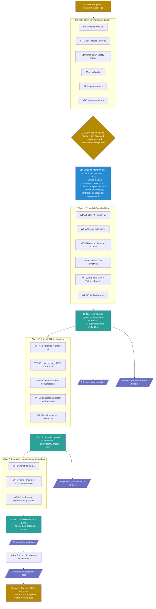

# K2 (Co-work Surface): Parallelized Execution DAG

The execution layer over [PRD.md](PRD.md) §10 and [architecture.md](architecture.md), in the same discipline as the kernel's [../implementation-dag.md](../implementation-dag.md). That pair owns WHAT gets built (requirements, invariants, component choices, amendment bundle). This document owns HOW: which pieces fan out to parallel builder subagents, where contracts freeze, where work joins, where tests gate, and where Kaden is structurally required.

**Status: plan only. Nothing here starts until three entry conditions are met (§2). Authored 2026-07-17, unreviewed.**

## 1. The orchestration model

**Roles.**
- **Orchestrator + verifier: the main session (me).** Freezes contracts before every wave, spawns builders, integrates their diffs, runs the suites, drives `/code-review` high on every landing, performs live browser verification of frontend work (dev server + the browser pane: screenshots, read_page, console/network checks), owns every commit and PR through `/wb-dev-pr`, runs the gates, maintains the deviations ledger. Integration and gate judgment are never delegated.
- **Builders: Opus subagents, worktree-isolated, one work package (WP) each**, spawned in parallel within a wave (Kaden's directive: Opus, parallel where regions permit). A builder receives a self-contained brief embedding the verbatim contract excerpts it codes against, and returns a branch/diff plus green tests in its worktree. Builders never touch paths outside their WP's owned set, never commit to the integration branch, never edit shared registration files (the orchestrator wires registrations at joins).
- **Kaden:** red-pens, picks at gates, merges every PR (hard rule), present for live testing.

**Work-package rules** (inherited from the kernel DAG): owned paths never overlap within a wave, every WP ships its own tests in the same delivery, definition of done = owned-path diff only + tests green in isolation + style rules honored (zero em-dashes, zero prose semicolons in docs/comments) + no transient narrative in durable surfaces. Builder failure: respawn with failure context (max two), then the orchestrator takes the WP or escalates.

**Verification protocol (the verifier half, per WP and per gate).**
1. Apply the diff onto the integration tree, run the WP's tests, then the full affected suite (uv run pytest for Python, npm test / playwright for dashboard-react).
2. Frontend WPs additionally get live verification: dev server via the launch config, browser-pane checks (rendered structure via read_page, console errors, network calls, screenshots as proof), Theme Contract spot-checks (dark + light, forced-colors), axe pass.
3. Gate-integrity checks are non-negotiable at every review-loop landing: N marks mint N gestures with N distinct hashes, stale-view marks rejected, agent self-confirm refused, silence changes nothing.
4. License audit on every dependency addition (exact-pinned, MIT/Apache only, nothing from a private registry).
5. `/code-review` at high effort on every PR diff before `/wb-dev-pr`, findings fixed or dispositioned.
6. Any deviation from PRD/architecture discovered mid-build goes to the PR body under a Deviations heading, never silently absorbed.

**Serialization constraints (must NOT parallelize).**
- `work_buddy/truth/lifecycle.py`, `redact.py`, `identity.py`, `events.py` have ONE owner (WP-A2) in their wave. Nothing else touches shipped kernel behavior files concurrently.
- `dashboard-react/package.json` has one owner per wave (WP-B2 in wave 1). Other FE WPs request dependencies through the orchestrator.
- Registration/wiring files (`dashboard/service.py` route mounting, gateway op registration, `dashboardRegistry.ts`) are orchestrator-only, wired at joins.
- Live testing is one-at-a-time: single machine, single MCP server, restarts required, Kaden present.

**Tracking.** No per-wave wb tasks (Kaden, 2026-07-17: overcrowds the task list, just perform the work). Progress lives in the orchestrating session and in this design directory (spike reports, join notes, PR bodies). The PRD stays the requirements source of truth.

## 2. Entry conditions (hard stops before anything runs)

1. **Kaden red-pens PRD.md v0.2** (or explicitly waives the full pass and red-pens §5, §6, §9 at minimum).
2. **Kaden nods §9 deviation 3**, the audit-shaped extension bundle (DDL + export v3 co-land + lifecycle/redact/identity/events extensions + op-level profile gating).
3. **Kaden says go.** Design-session momentum is not a build order (standing rule).

## 3. Global DAG

Kaden merges every PR (not drawn per edge). PR granularity may consolidate at execution time (for example beta+gamma) if diffs stay reviewable, decided at the join, never mid-wave.

## 4. S0: the spike suite (parallel, throwaway)

Spikes run in an isolated scratch workspace (pinned deps, real doc corpus mounted read-only), never merged. Each returns a written spike report. Checklist source: [tiptap-docs-audit.md](tiptap-docs-audit.md) section A.

| Spike | Answers | Key cases | Model |
|---|---|---|---|
| SP-1 engine bake-off | which tracked-change engine wins the fork | suggest-changes (primary) vs tiptap-track-changes vs suggestion-mode vs changeset-custom fallback: agent-proposal ingestion, overlapping edits, accept/reject correctness, code-block + atom-node edits (audit A5), mark flag matrix incl. inclusive=false at span edges (A4), paste-forgery defense (A3), diff layer ignoring node_id + provenance attrs (A16), dispatchTransaction layering (A7) | Opus |
| SP-2 Yjs + React probe | substrate viability facts | Collaboration on a local persisted Y.Doc, UniqueID types + init order (A8), undo-vs-marks survival incl. undo-after-accept (A14), React 19 StrictMode double-mount with persistence attached (A13) | Opus |
| SP-3 markdown fidelity | can the projection contract hold | import -> materialize on 20+ real repo/vault docs, block-splice strategy, unedited-region byte preservation, unknown syntax (wikilinks, callouts) preserved verbatim + flagged, contentType threading at one ingest boundary (A11), normalization tolerance rules for edited blocks (A10) | Opus |
| SP-4 perf probe | the §11 numbers | keystroke-to-paint at 10k/50k words with 300 decorations, open time, memory across a long session, useEditorState selector pattern (A12) | Opus |
| SP-5 apcore verdict | adopt, wrap, or reject `tiptap-apcore` | overlap with the house capability registry, safety-tag model, what reimplementation costs (distilled D10) | Opus |
| SP-6 sidebar mockups | Kaden's Review-tab organization pick | 2-3 low-fi mockups of the Word-review-mode layout: margin-card grouping, filtering, where claim review lives | orchestrator + one Opus pass |

**GATE S0 (Kaden):** engine choice ratified on the bake-off evidence, fidelity findings + §11 perf numbers accepted or adjusted, apcore decided, sidebar direction picked. Then C1 freezes.

## 5. Contract freeze C1 (orchestrator, before wave 1)

Written artifacts, verbatim-embedded into every affected builder brief:

1. The **v2 DDL text** (documents, document_spans, expressions, proposals, doc events, per-table append-only triggers, proposal redaction carve-out) honoring the audit's trigger-burden caveat.
2. The **export v3 spec**: record registry additions, format_version bump, Y.Doc snapshot blobs, upcast rules (audit F1 co-land rule).
3. **Engine module signatures**: `work_buddy/truth/documents.py`, `proposals.py`, `expressions.py`, `ydoc_store.py`, plus the layering rule: ledger machinery lives in `work_buddy/truth/`, the surface layer (routes glue, ops, feedback, sittings, doc conversations) lives in the new `work_buddy/cowork/` package, calling down.
4. The **`/api/truth/doc/*` route contract** (shapes, marks submission with per-item displayed hashes, Yjs blob transport, SSE event names) and the **binding contract-freeze notes** from the audit: sittings HTTP-only, routes call the engine library directly, real user identity threads into gesture actors.
5. **`cowork_doc_*` op parameter schemas** + capability unit drafts.
6. The **`WbTrackedChangesAdapter` interface** and the **fork repo**: the chosen engine forked to a pinned KadenMc repo (mode 3), commit-pinned in package.json.
7. The **profile policy block schema** (op-level gating, per audit F4) and the **wb.cowork contribution shape** (view, slots, widget roles, COMPONENTS.md plan).
8. Shared test scaffolding: conftest additions, fixture formats, the fidelity-corpus manifest.

## 6. Wave 1 (6 parallel Opus builders)

| WP | Owned paths | Builds | Size |
|---|---|---|---|
| A1 DDL + export | `work_buddy/truth/migrations.py` (append v2), `export.py`, their tests, backup-integration test updates | v2 migration + triggers from frozen DDL, export registry growth + FORMAT_VERSION 3 + snapshot blobs + upcast, frozen-fixture coverage | L |
| A2 kernel extensions | `lifecycle.py`, `redact.py`, `identity.py`, `events.py` + tests | proposal gesture subjects + allowed-kind sets, redirect/endorse kinds, proposal redaction subjects, URI kinds, truth.doc_* event types (audit F2, F3, F5, F6, F7) | M-L |
| A3 document engine | new `documents.py`, `proposals.py`, `expressions.py`, `ydoc_store.py`, `store.py` (additive insert paths only) + tests | registration/retire, proposal ledger lifecycle (open/decided/applied/closed/expired as status events), expression creation paths, Y.Doc snapshot + update-log persistence + compaction, drift hash recording. Codes against the FROZEN DDL via conftest (A1 lands the migration in the same wave) | L |
| B1 chat primitives | `dashboard-react/src/widget-library/chat/**` + tests | the conversations chat surface as reusable React primitives per the contribution architecture (message list, composer, sidebar frame, provider seam over `conversation_*` + SSE), mirroring the legacy dashboard's chat-sidebar behavior. Independent of all truth work | M-L |
| B2 Co-work substrate | `dashboard-react/src/apps/cowork/**` (view shell, editor pane, `@work-buddy/tiptap` extension bundle), `package.json` (sole owner this wave) + tests | wb.cowork contribution scaffolding, Tiptap editor over local persisted Y.Doc, markdown import, writing UX with input rules, mark flag matrix from SP-1, paste-forgery defenses, provenance tinting hooks | L |
| B5 fidelity harness | fidelity suite files (dashboard-react tests + corpus fixtures + engine-side hash checks) | the projection-conformance suite as an executable gate: corpus manifest, block-splice verification, byte-preservation checks, flagged-unknowns report | M |

**JOIN J1 (orchestrator):** integrate A1+A2+A3, full kernel suite green, INVARIANT_COVERAGE.md extended to the new tables (unmapped invariant = missing test = not done), export round-trip + backup staging proven with document rows present. B1/B2 verified live in the browser pane. Then **PR-alpha** (B1, independently mergeable) and **PR-beta** (kernel bundle) via `/wb-dev-pr`. Kaden merges.

## 7. Wave 2 (5 parallel Opus builders)

| WP | Owned paths | Builds | Size |
|---|---|---|---|
| A4 routes + sittings | new `work_buddy/cowork/api.py` (+ Flask test-client tests, service.py mounting done by orchestrator at join) | `/api/truth/doc/*` per the frozen contract: open/get with proposals + expressions + hashes, Yjs blob push/pull, marks submission minting one gesture per item via the ENGINE LIBRARY under user_initiated, stale-view rejection, materialize/drift/diff/re-import, real user identity threading | M-L |
| A5 MCP surface | new `work_buddy/cowork/ops.py`, `knowledge/store/cowork/*.md` units (gateway registration at join) | `cowork_doc_list/get/propose_edit/comment/expression_mark` per frozen schemas, propose-weight consent declarations, editing-kernel rule enforced (registered-doc file writes refused at the capability layer) | M |
| A6 feedback + conversations | new `work_buddy/cowork/feedback.py`, `conversations.py` glue + tests | span-anchored verbatim feedback as user_authored evidence + document-conversation binding (one conversation per doc), redirect/endorse routing into the owning agent session | M |
| B3 suggestion adapter | `dashboard-react/src/apps/cowork/suggestions/**` (incl. the in-tree vendored engine at `suggestions/engine/` with per-file MIT attribution + PROVENANCE.md) + in-tree vendored engine patches + tests | `WbTrackedChangesAdapter` over the vendored engine: proposal ingestion to marks, tracked-change rendering, per-item mark collection, re-anchor-from-ledger on drift, sitting submission client | L |
| B4 rail + inspector | `dashboard-react/src/apps/cowork/rail/**` + tests | Review tab per the SP-6 pick: margin cards aligned to anchors, mark bar verbs, claim cards + the six claim verbs, expression chips + click-a-sentence inspector, dirty-state + localStorage drafts | M-L |

**JOIN J2 (orchestrator):** wire registrations, run the review loop end to end in dev (MCP propose, SSE nudge, render, mark, submit, gestures minted, edits applied, file materialized), gate-integrity checks (verification protocol item 3), Flask-test-client suite green. Then **PR-gamma** (service + MCP). Kaden merges.

## 8. Wave 3 (3 parallel + orchestrator integration)

| WP | Owned paths | Builds | Size |
|---|---|---|---|
| B6 Chat tab | `dashboard-react/src/apps/cowork/chat/**` + tests | the document conversation on B1 primitives: feedback entry from selection, agent replies, links from chat items to anchored spans | M |
| B7 conformance | `dashboard-react/tests/e2e/**` additions, axe/theme/forced-colors/reduced-motion coverage, widget-lab states | the dashboard-citizenship proof obligations (I18) for every new component | M |
| C2 polish | slash menu (cmdk), keyboard completeness (j/k inverted personal binding, configurable), route-change guards | the writing-flow finish per PRD §7 | M |

Orchestrator in parallel: **C1-integration** (drift guard + re-import flow proven on a real out-of-band edit, `.data/designs/` dogfood store registered with this design's own documents, suggested first content per the PRD).

**JOIN J3:** full slice live on real content, fidelity suite green on the corpus, perf numbers measured against §11 on the reference machine. Then **PR-delta** (Co-work view). After merge: **C3** runs `/wb-dev-document` for the durable units (architecture/cowork, capability units already landed with A5, COMPONENTS.md complete), then **PR-epsilon**.

**Exit (Kaden, replacing the formal gate per his call):** the holistic judgment sitting on the working slice, truth + surface together. Findings route to a punch-list wave, not silent scope growth.

## 9. Standing rules

1. Never widen a wave mid-flight: discovered work goes to the next wave or the backlog.
2. Builders get verbatim contract excerpts, never doc pointers alone.
3. A flaky test is a finding, not a retry excuse.
4. Devils-advocate checkpoints: on the C1 freeze artifacts (schema + export v3 + route contract) before wave 1, and on the J2 gate-integrity evidence. Elsewhere `/code-review` high suffices.
5. Deviations surface in PR bodies under a Deviations heading.
6. Style rules bind all generated text (zero em-dashes, zero prose semicolons, DDL terminators exempt).
7. Worktree hygiene: builder worktrees are cleaned after their diffs are applied.

---

*Provenance: authored 2026-07-17 by the Co-work design session on Kaden's request for a delegator/verifier execution plan over parallel Opus builders. Companion to PRD.md v0.2 (requirements), architecture.md (composition), foundation-audit.md (amendment bundle), tiptap-docs-audit.md (S0 checklist). Plan only: execution starts on the §2 entry conditions.*
