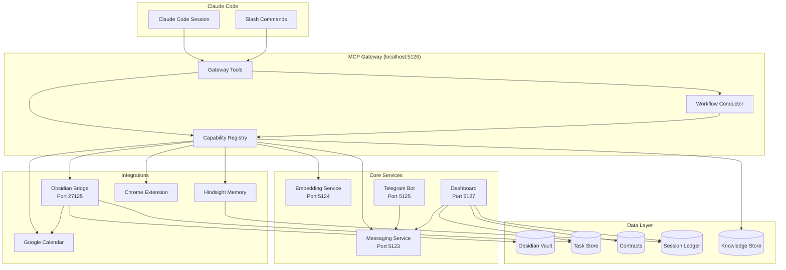

# Architecture

work-buddy runs as a set of local processes that extend Claude Code. This page is the single view of how those pieces fit together. For the detail behind any one box, follow the handbook links under each section below.

## The gateway

Every session talks to work-buddy through one MCP server, the gateway, running on `localhost:5126`. Instead of exposing hundreds of tools to the agent, the gateway offers a small, fixed set of `wb_*` tools and lets the agent discover everything else at runtime:

- `wb_init` registers the session, and is the required first call.
- `wb_search` finds a capability or workflow from a natural-language query and returns its parameters.
- `wb_run` executes a capability or starts a workflow.
- `wb_advance` moves a running workflow to its next step.
- `wb_status` reports workflow progress or overall system health.
- `wb_step_result` and `wb_capability_result` fetch a full result when a large response was elided to keep the conversation small.

Behind the gateway, the capability registry is the catalog of everything work-buddy can do, and `wb_search` ranks it. See [the gateway](handbook/operations_mcp-gateway.md) and [the capability registry](handbook/architecture_capability-registry.md).

## The conductor

Multi-step work is expressed as a workflow, a small dependency graph of steps. The workflow conductor runs it: ordering steps, resuming cleanly after an interruption, and deciding which steps need the model and which are plain code. Steps that only load or shape data run deterministically, so the agent is invoked only where judgment is actually required. See [workflows](handbook/architecture_workflows.md).

## Core services

A few long-running services sit behind the gateway, each on its own local port:

- **Messaging** (`5123`) carries messages between agents and between surfaces. See [messaging](handbook/services_messaging.md).
- **Embedding** (`5124`) serves the vectors behind semantic search and knowledge retrieval. See [the embedding service](handbook/architecture_embedding-service.md).
- **Telegram bot** (`5125`) is the phone-side surface for approvals, questions, and capture. See [Telegram](handbook/notifications_telegram.md).
- **Dashboard** (`5127`) is the web control surface, with live status, conversation threads, and decision prompts. See [the dashboard](handbook/services_dashboard.md).

## Integrations

work-buddy reaches into the tools your work already lives in:

- The **Obsidian bridge** (`27125`) gives plugin-level access to your vault, not just file reads and writes. See [Obsidian](handbook/obsidian.md).
- **Hindsight** provides persistent memory that survives across sessions. See [memory](handbook/memory_hindsight.md).
- **Calendar** and the **Chrome extension** bring your schedule and your open tabs into the same runtime. See [calendar](handbook/calendar.md) and [the browser integration](handbook/browser.md).

## The knowledge store

The knowledge store is where work-buddy keeps what it knows about itself: every capability, workflow, and behavioral direction, held as interlinked units the agent reads at runtime through `wb_search` and `agent_docs`. It is also the source these documentation pages are generated from, so the handbook and the agent's own knowledge never drift apart. See [the knowledge system](handbook/architecture_knowledge-system.md).

## Local data

Your actual work stays on your machine: the Obsidian vault, the task store, contracts, the session ledger, and the knowledge store itself. The full on-disk layout, including the separate install, config, and data roots, is documented in [the repository structure](handbook/architecture_repo-structure.md).

## The sidecar supervisor

The services above do not run themselves. A sidecar supervisor starts them on demand, restarts them on failure, and health-checks them on a schedule, so the gateway can assume its dependencies are up. You control it from any shell with `wbuddy start`, `wbuddy stop`, and `wbuddy status`. See [the sidecar](handbook/services_sidecar.md).

---

For anything not covered here, the [handbook](handbook/index.md) is the complete, auto-generated reference.
