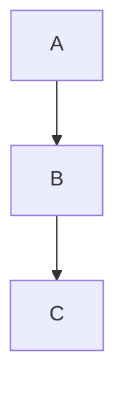

# Mixed code fences

A backtick fence with a language info string:

```python
def hello():
    print("hi")
```

A tilde fence with a language info string:

~~~js
const y = 2
~~~

A mermaid fence that must survive its info string and body verbatim:



A dataview fence:

```dataview
TABLE status FROM #project
```

An indented code block using four spaces:

    indented line one
    indented line two

A fence containing nested tilde markers inside a backtick fence:

````markdown
~~~
not a real fence, just text
~~~
````

Final paragraph after the fences.
